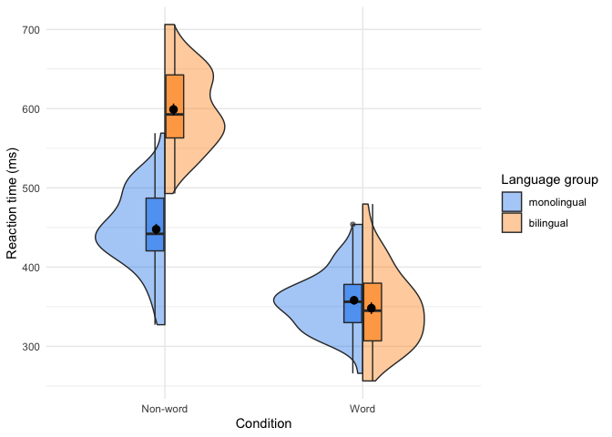
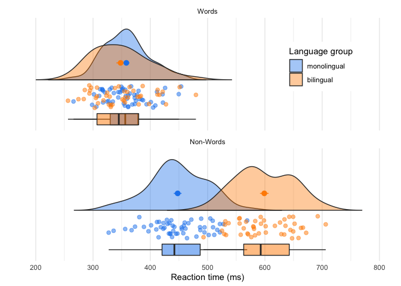

<!-- README.md is generated from README.Rmd. Please edit that file -->

# introdataviz

<!-- badges: start -->
<!-- badges: end -->

## Installation

You can install introdataviz with:

``` r
# you may have to install devtools first with 
# install.packages("devtools")

devtools::install_github("psyteachr/introdataviz")
```

``` r
library(introdataviz)
```

## Workbook functions

Open a local copy of the book:

``` r
introdataviz::book()
```

Save the workbook and data file to your working directory and open the
workbook in RStudio:

``` r
introdataviz::workbook()
```

## Data functions

`ldt_data` is the main data set we use in the tutorials. It is simulated
stroop task data for monolingual and bilingual participants. DVs are
mean reaction time (rt) and accuracy (acc) for words and non-words.

| id   | age | language | rt\_word | rt\_nonword | acc\_word | acc\_nonword |
|:-----|----:|---------:|---------:|------------:|----------:|-------------:|
| S001 |  22 |        1 | 379.4585 |    516.8176 |        99 |           90 |
| S002 |  33 |        1 | 312.4513 |    435.0404 |        94 |           82 |
| S003 |  23 |        1 | 404.9407 |    458.5022 |        96 |           87 |
| S004 |  28 |        1 | 298.3734 |    335.8933 |        92 |           76 |
| S005 |  26 |        1 | 316.4250 |    401.3214 |        91 |           83 |
| S006 |  29 |        1 | 357.1710 |    367.3355 |        96 |           78 |

`ldt_long` is `ldt_data` converted to a different (longer) format for
plotting and converting the numeric value for `language` into words.

| id   | age | language    | condition |       rt | acc |
|:-----|----:|:------------|:----------|---------:|----:|
| S001 |  22 | monolingual | word      | 379.4585 |  99 |
| S001 |  22 | monolingual | nonword   | 516.8176 |  90 |
| S002 |  33 | monolingual | word      | 312.4513 |  94 |
| S002 |  33 | monolingual | nonword   | 435.0404 |  82 |
| S003 |  23 | monolingual | word      | 404.9407 |  96 |
| S003 |  23 | monolingual | nonword   | 458.5022 |  87 |

## Plotting functions

This package also provides two functions (`geom_split_violin()` and
`geom_flat_violin()`) used to make split-violin and raincloud plots
(modified from code by [Allen et al.,
2021](https://doi.org/10.12688/wellcomeopenres.15191.2)).

### Split-violin plots

Split-violin plots remove the redundancy of mirrored violin plots and
make it easier to compare the distributions between multiple conditions.

``` r
colours <- c("dodgerblue2", "darkorange")

ggplot(ldt_long, aes(x = condition, y = rt, fill = language)) +
  introdataviz::geom_split_violin(alpha = .4) +
  geom_boxplot(width = .2, alpha = .6, show.legend = FALSE) +
  stat_summary(fun.data = "mean_se", geom = "pointrange", show.legend = F, 
               position = position_dodge(.175)) +
  scale_x_discrete(name = "Condition", labels = c("Non-word", "Word")) +
  scale_y_continuous(name = "Reaction time (ms)") +
  scale_fill_manual(values = colours, name = "Language group") +
  theme_minimal()
```

<div class="figure">


<p class="caption">
Split-violin plot
</p>

</div>

### Raincloud plots

Raincloud plots combine a density plot, boxplot, raw data points, and
any desired summary statistics for a complete visualisation of the data.
They are so called because the density plot plus raw data is reminiscent
of a rain cloud.

``` r
rain_height <- .1

ggplot(ldt_long, aes(x = "", y = rt, fill = language)) +
  # clouds
  introdataviz::geom_flat_violin(trim=FALSE, alpha = 0.4,
    position = position_nudge(x = rain_height+.05)) +
  # rain
  geom_point(aes(colour = language), size = 2, alpha = .5, show.legend = FALSE, 
              position = position_jitter(width = rain_height, height = 0)) +
  # boxplots
  geom_boxplot(width = rain_height, alpha = 0.5, show.legend = FALSE, 
               outlier.shape = NA,
               position = position_nudge(x = -rain_height*2)) +
  # mean and SE point in the cloud
  stat_summary(fun.data = mean_se, mapping = aes(color = language), show.legend = FALSE,
               position = position_nudge(x = rain_height * 3)) +
  # adjust layout
  scale_x_discrete(name = "", expand = c(rain_height*3, 0, 0, 0.7)) +
  scale_y_continuous(name = "Reaction time (ms)",
                     breaks = seq(200, 800, 100), 
                     limits = c(200, 800)) +
  coord_flip() +
  facet_wrap(~factor(condition, 
                     levels = c("word", "nonword"), 
                     labels = c("Words", "Non-Words")), 
             nrow = 2) +
  # custom colours and theme
  scale_fill_manual(values = colours, name = "Language group") +
  scale_colour_manual(values = colours) +
  theme_minimal() +
  theme(panel.grid.major.y = element_blank(),
        legend.position = c(0.8, 0.8),
        legend.background = element_rect(fill = "white", color = "white"))
#> Warning: Removed 10 rows containing missing values (violinist).
```

<div class="figure">


<p class="caption">
Raincloud plot
</p>

</div>
