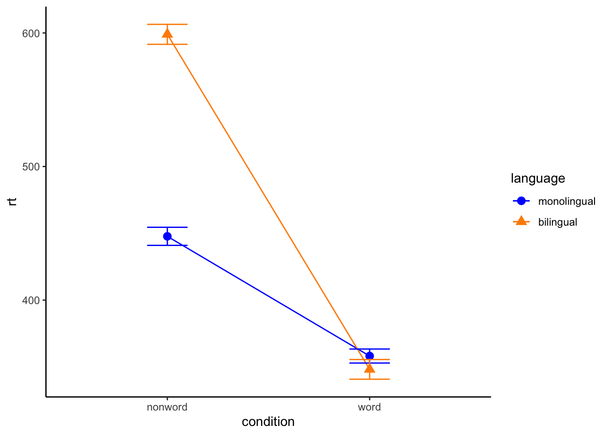
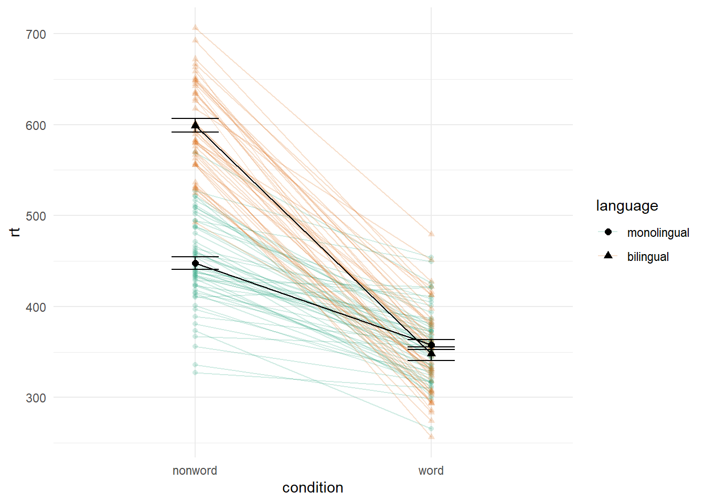
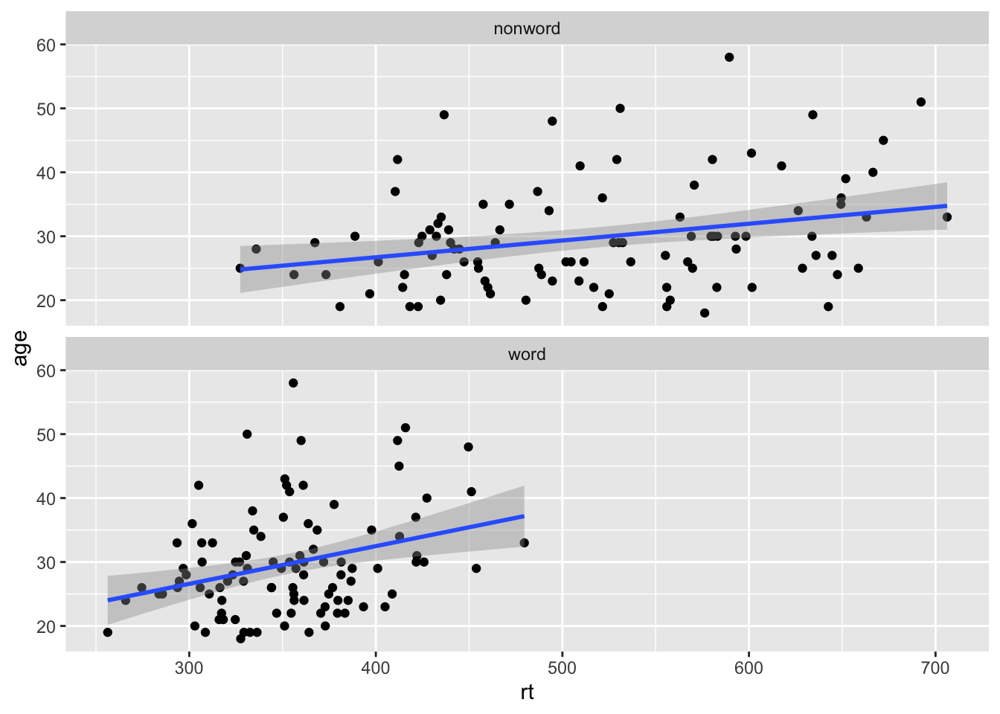
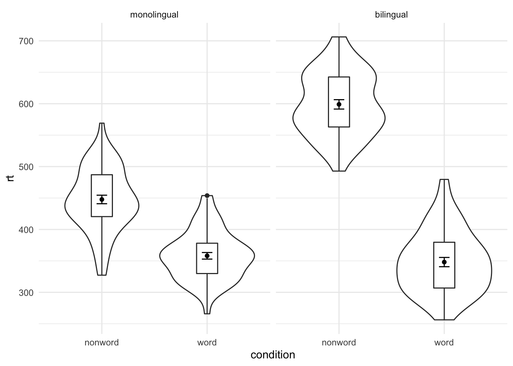
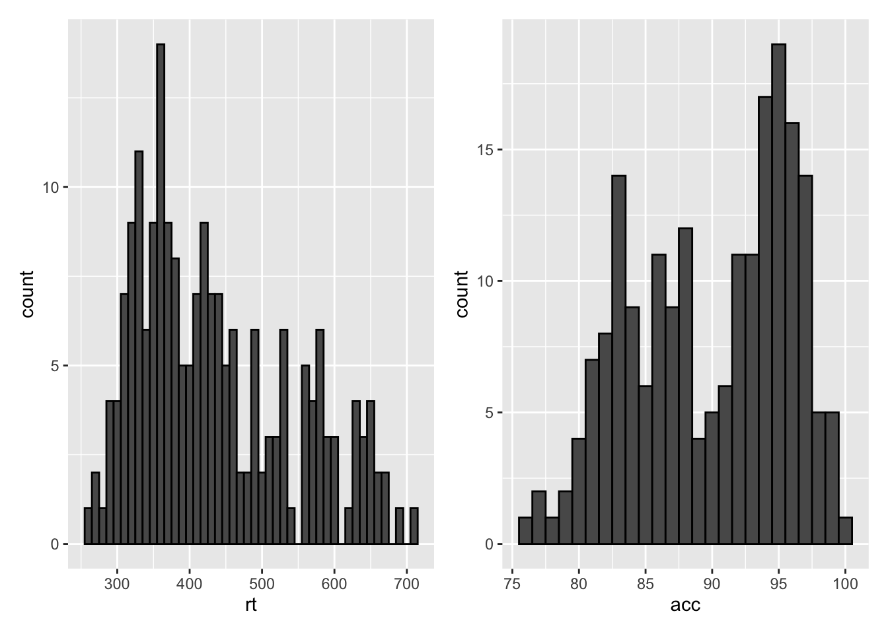
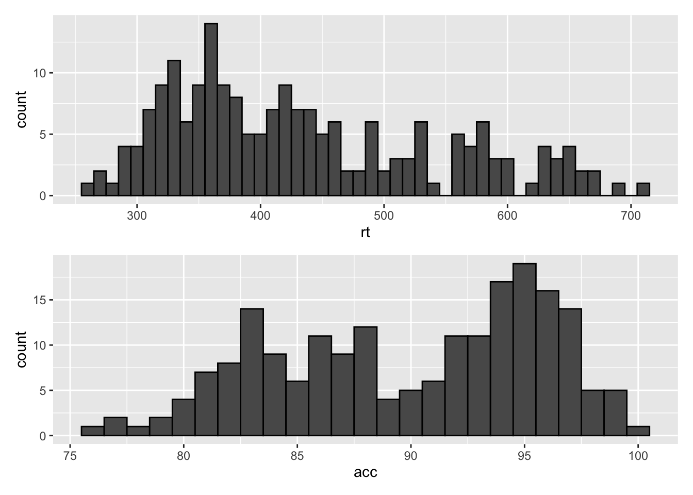
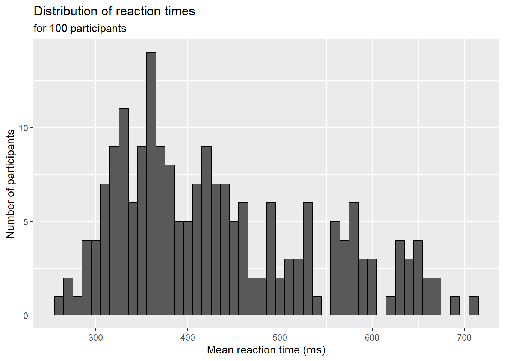
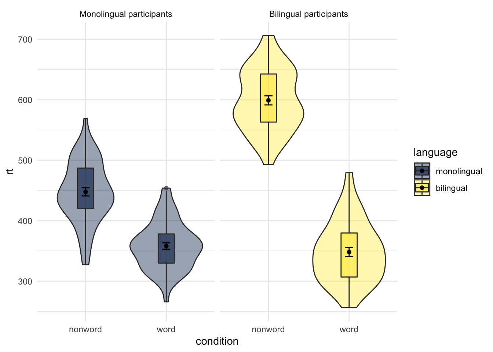
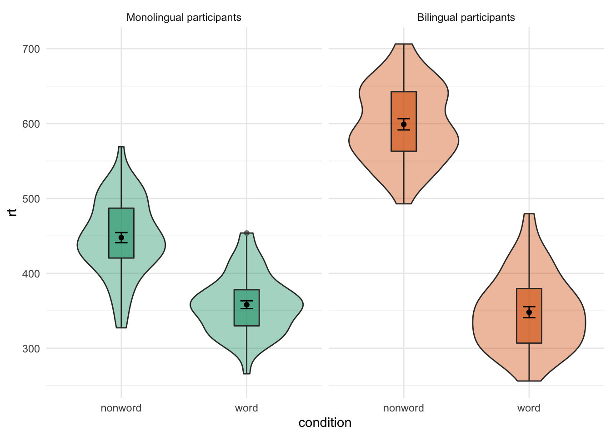

# Multi-part Plots

## Interaction plots

Interaction plots are commonly used to help display or interpret a factorial design. Just as with the bar chart of means, interaction plots represent data summaries and so they are built up with a series of calls to `stat_summary()`.

-   `shape` acts much like `fill` in previous plots, except that rather than producing different colour fills for each level of the IV, the data points are given different shapes.

-   `size` lets you change the size of lines and points. You usually don't want different groups to be different sizes, so this option is set inside the relevant `geom_*()` function, not inside the `aes()` function.

- `scale_color_manual()` works much like `scale_color_discrete()` except that it lets you specify the colour values manually, instead of then being automatically applied based on the palette you choose/default to. You can specify RGB colour values or a list of predefined colour names - all available options can be found by running `colours()` in the console. Other manual scales are also available, for example, `scale_fill_manual`.


```r
ggplot(dat_long, aes(x = condition, y = rt, 
                     shape = language,
                     group = language,
                     color = language)) +
  stat_summary(fun = "mean", geom = "point", size = 3) +
  stat_summary(fun = "mean", geom = "line") +
  stat_summary(fun.data = "mean_se", geom = "errorbar", width = .2) +
  scale_color_manual(values = c("blue", "darkorange")) +
  theme_classic()
```

<div class="figure" style="text-align: center">

<p class="caption">(\#fig:ixn)Interaction plot.</p>
</div>

## Combined interaction plots

A more complex interaction plot can be produced that takes advantage of the layers to visualise not only the overall interaction, but the change across conditions for each participant.

This code is more complex than all prior code because it does not use a universal mapping of the plot aesthetics. In our code so far, the aesthetic mapping (`aes`) of the plot has been specified in the first line of code as all layers have used the same mapping, however, is is also possible for each layer to use a different mapping.

-   The first call to `ggplot()` sets up the default mappings of the plot that will be used unless otherwise specified - the `x`, `y` and `group` variable. Note two additions are `shape` and `linetype` that will vary those elements according to the language variable.
-   `geom_point()` overrides the default mapping by setting its own `colour` to draw the data points from each language group in a different colour. `alpha` is set to a low value to aid readability. Note that because the aesthetic override was defined within the geom function, the colours are not represented in the legend.
-   Similarly, `geom_line()` overrides the default grouping variable so that a line is drawn to connect the individual data points for each *participant* (`group = id`) rather than each language group, and also sets the colours.  The default line type is also overridden and set for all lines to be solid.
-   Finally, the calls to `stat_summary()` remain largely as they were, with the exception of setting `colour = "black"` and `size = 2` so that the overall means and error bars can be more easily distinguished from the individual data points. Because they do not specify an individual mapping, they use the defaults (e.g., the lines are connected by language group). For the error bars the lines are again made solid.


```r
ggplot(dat_long, aes(x = condition, y = rt, 
                     group = language, shape = language)) +
  geom_point(aes(colour = language),alpha = .2) +
  geom_line(aes(group = id, colour = language), alpha = .2) +
   stat_summary(fun = "mean", geom = "point", size = 2, colour = "black") +
  stat_summary(fun = "mean", geom = "line", colour = "black") +
  stat_summary(fun.data = "mean_se", geom = "errorbar", 
               width = .2, colour = "black") +
  theme_minimal()
```

<div class="figure" style="text-align: center">

<p class="caption">(\#fig:ixn-by-subj)Interaction plot with by-participant data</p>
</div>

## Facets

So far we have produced single plots that display all the desired variables in one, however, there are situations in which it may be useful to create separate plots for each level of a variable. The below code is an adaptation of the code used to produce the grouped scatterplot (see Figure\ \@ref(fig:viobox2)) in which it may be easier to see how the relationship changes when the data are not overlaid.

-   Rather than using `colour = condition` to produce different colours for each level of `condition`, this variable is instead passed to `facet_wrap()`.


```r
ggplot(dat_long, aes(x = rt, y = age)) +
  geom_point() +
  geom_smooth(method = "lm") +
  facet_wrap(~condition)
```

<div class="figure" style="text-align: center">

<p class="caption">(\#fig:scatterplot-facet)Faceted scatterplot</p>
</div>

As another example, we can use `facet_wrap()` as an alternative to the grouped violin-boxplot (see Figure\ \@ref(fig:viobox3)) in which the variable `language` is passed to `facet_wrap()` rather than `fill`.


```r
ggplot(dat_long, aes(x = condition, y= rt)) +
  geom_violin() +
  geom_boxplot(width = .2, fatten = NULL) +
  stat_summary(fun = "mean", geom = "point") +
  stat_summary(fun.data = "mean_se", geom = "errorbar", width = .1) +
  facet_wrap(~language) +
  theme_minimal()
```

<div class="figure" style="text-align: center">

<p class="caption">(\#fig:violin-boxplot-facet)Facted violin-boxplot</p>
</div>

Finally, note that editing the labels for faceted variables involves converting the `language` column into a factor. This allows you to set the order of the `levels` and the `labels` to display.


```r
ggplot(dat_long, aes(x = condition, y= rt)) +
  geom_violin() +
  geom_boxplot(width = .2, fatten = NULL) +
  stat_summary(fun = "mean", geom = "point") +
  stat_summary(fun.data = "mean_se", geom = "errorbar", width = .1) +
  facet_wrap(~factor(language, 
                     levels = c("monolingual", "bilingual"),
                     labels = c("Monolingual participants", 
                                "Bilingual participants"))) +
  theme_minimal()
```

<div class="figure" style="text-align: center">

<p class="caption">(\#fig:violin-facet)Faceted violin-boxplot with updated labels</p>
</div>

## Storing plots

Just like with datasets, plots can be saved to objects. The below code saves the histograms we produced for reaction time and accuracy to objects named `p1` and `p2`. These plots can then be viewed by calling the object name in the console.


```r
p1 <- ggplot(dat_long, aes(x = rt)) +
  geom_histogram(binwidth = 10, color = "black")

p2 <- ggplot(dat_long, aes(x = acc)) +
  geom_histogram(binwidth = 1, color = "black") 
```

Importantly, layers can then be added to these saved objects. For example, the below code adds a theme to the plot saved in `p1` and saves it as a new object `p3`. This is important because many of the examples of `ggplot` code you will find in online help forums use the `p +` format to build up plots but fail to explain what this means, which can be confusing to beginners.


```r
p3 <- p1 + theme_minimal()
```

## Saving plots as images

In addition to saving plots to objects for further use in R, the function `ggsave()` can be used to save plots as images on your hard drive. The only required argument for `ggsave` is the file name of the image file you will create, complete with file extension (this can be "eps", "ps", "tex", "pdf", "jpeg", "tiff", "png", "bmp", "svg" or "wmf"). By default, `ggsave()` will save the last plot displayed, however, you can also specify a specific plot object if you have one saved.


```r
ggsave(filename = "my_plot.png") # save last displayed plot
ggsave(filename = "my_plot.png", plot = p3) # save plot p3
```

The width, height and resolution of the image can all be manually adjusted and the help documentation for is useful here (type `?ggsave` in the console to access the help).

## Multiple plots

As well as creating separate plots for each level of a variable using `facet_wrap()`, you may also wish to display multiple different plots together and the `patchwork` package provides an intuitive way to do this. `patchwork` does not require the use of any functions once it is loaded with `library(patchwork)`, you simply need to save the plots you wish to combine to objects as above and use the operators `+`, `/` `()` and `|` to specify the look of the final figure.

### Combining two plots

Two plots can be combined side-by-side or stacked on top of each other. These combined plots could also be saved to an object and then passed to `ggsave`.


```r
p1 + p2 # side-by-side
```

<div class="figure" style="text-align: center">

<p class="caption">(\#fig:patchwork-side)Side-by-side plots with patchwork</p>
</div>


```r
p1 / p2 # stacked
```

<div class="figure" style="text-align: center">

<p class="caption">(\#fig:patchwork-stack)Stacked plots with patchwork</p>
</div>

### Combining three or more plots

Three or more plots can be combined in a number of ways and the `patchwork` syntax is relatively easy to grasp with a few examples and a bit of trial and error. First, we save the complex interaction plot and faceted violin-boxplot to objects named `p5` and `p6`.


```r
p5 <- ggplot(dat_long, aes(x = condition, y = rt, 
                           group = language, 
                           shape = language)) +
  geom_point(aes(colour = language),
             alpha = .2) +
  geom_line(aes(group = id, colour = language), 
            alpha = .2) +
  stat_summary(fun = "mean", 
               geom = "point", 
               size = 2, 
               colour = "black") +
  stat_summary(fun = "mean", 
               geom = "line", 
               colour = "black") +
  stat_summary(fun.data = "mean_se", 
               geom = "errorbar", 
               width = .2, 
               colour = "black") +
  theme_minimal()

p6 <- ggplot(dat_long, aes(x = condition, y= rt)) +
  geom_violin() +
  geom_boxplot(width = .2, fatten = NULL) +
  stat_summary(fun = "mean", geom = "point") +
  stat_summary(fun.data = "mean_se", geom = "errorbar", width = .1) +
  facet_wrap(~factor(language, 
                     levels = c("monolingual", "bilingual"),
                     labels = c("Monolingual participants", 
                                "Bilingual participants"))) +
  theme_minimal()
```

The exact layout of your plots will depend upon a number of factors. Try running the below examples and adjust the use of the operators to see how they change the layout. Each line of code will draw a different figure.


```r
p1 /p5 / p6 
(p1 + p6) / p5 
p6 | p1 / p5 
```

## Customisation part 4

### Axis labels

Previously when we edited the main axis labels we used the `scale_` functions to do so. These functions are useful to know because they allow you to customise each aspect of the scale, for example, the breaks and limits. However, if you only need to change the main axis `name`, there is a quicker way to do so using `labs()`. The below code adds a layer to the plot that changes the axis labels for the histogram saved in `p1` and adds a title and subtitle. The title and subtitle do not conform to APA standards (more on APA formatting in the additional resources), however, for presentations and social media they can be useful.


```r
p5 + labs(x = "Type of word",
          y = "Reaction time (ms)",
          title = "Language group by word type interaction plot",
          subtitle = "Reaction time data")
```

<div class="figure" style="text-align: center">

<p class="caption">(\#fig:edited-labels)Plot with edited labels and title</p>
</div>

You can also use `labs()` to remove axis labels, for example, try adjusting the above code to `x = NULL`.

### Redundant aesthetics

So far when we have produced plots with colours, the colours were the only way that different levels of a variable were indicated, but it is sometimes preferable to indicate levels with both colour and other means, such as facets or x-axis categories.

The code below adds `fill = language` to the violin-boxplots that are also faceted by language. We adjust `alpha` and use the viridis colour palette to customise the colours.


```r
ggplot(dat_long, aes(x = condition, y= rt, fill = language)) +
  geom_violin(alpha = .4) +
  geom_boxplot(width = .2, fatten = NULL, alpha = .6) +
  stat_summary(fun = "mean", geom = "point") +
  stat_summary(fun.data = "mean_se", geom = "errorbar", width = .1) +
  facet_wrap(~factor(language, 
                     levels = c("monolingual", "bilingual"),
                     labels = c("Monolingual participants", 
                                "Bilingual participants"))) +
  theme_minimal() +
  scale_fill_viridis_d(option = "E")
```

<div class="figure" style="text-align: center">

<p class="caption">(\#fig:unnamed-chunk-6)Violin-boxplot with redundant legend</p>
</div>

Specifying a `fill` variable means that by default, R produces a legend for that variable. However, the use of colour is redundant with the facet labels, so you can remove this legend with the `guides` function.


```r
ggplot(dat_long, aes(x = condition, y= rt, fill = language)) +
  geom_violin(alpha = .4) +
  geom_boxplot(width = .2, fatten = NULL, alpha = .6) +
  stat_summary(fun = "mean", geom = "point") +
  stat_summary(fun.data = "mean_se", geom = "errorbar", width = .1) +
  facet_wrap(~factor(language, 
                     levels = c("monolingual", "bilingual"),
                     labels = c("Monolingual participants", 
                                "Bilingual participants"))) +
  theme_minimal() +
  scale_fill_viridis_d(option = "E") +
  guides(fill = FALSE)
```

<div class="figure" style="text-align: center">

<p class="caption">(\#fig:legend-suppress)Plot with suppressed redundant legend</p>
</div>

## Activities 4

Before you go on, do the following:

1.  Rather than mapping both variables (`condition` and `language)` to a single interaction plot with individual participant data, instead produce a faceted plot that separates the monolingual and bilingual data. All visual elements should remain the same (colours and shapes) and you should also take care not to have any redundant legends.


<div class='solution'><button>Solution</button>


```r
ggplot(dat_long, aes(x = condition, y = rt, group = language, shape = language)) +
  geom_point(aes(colour = language),alpha = .2) +
  geom_line(aes(group = id, colour = language), alpha = .2) +
  stat_summary(fun = "mean", geom = "point", size = 2, colour = "black") +
  stat_summary(fun = "mean", geom = "line", colour = "black") +
  stat_summary(fun.data = "mean_se", geom = "errorbar", width = .2, colour = "black") +
  theme_minimal() +
  facet_wrap(~language) +
  guides(shape = FALSE, colour = FALSE) 
```


```r
# this wasn't easy so if you got it, well done!
```


</div>


2.  Choose your favourite three plots you've produced so far in this tutorial, tidy them up with axis labels, your preferred colour scheme, and any necessary titles, and then combine them using `patchwork`. If you're feeling particularly proud of them, post them on Twitter using \#PsyTeachR.
