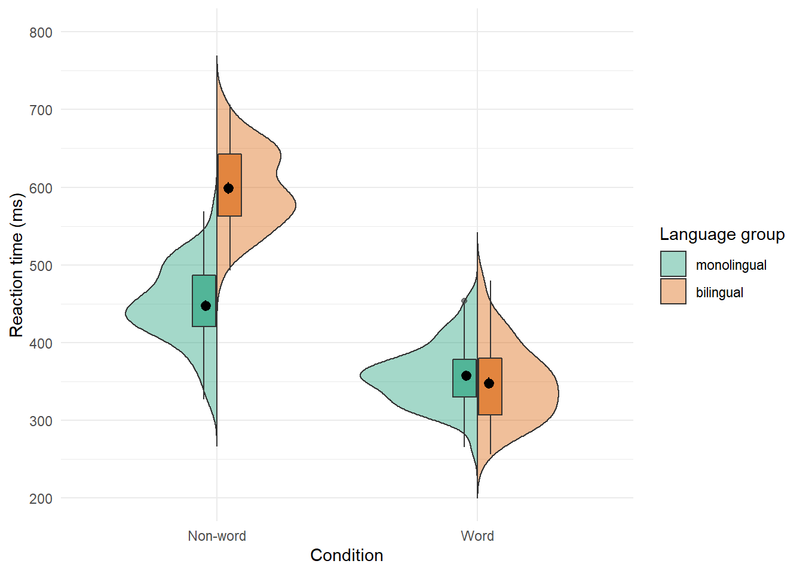
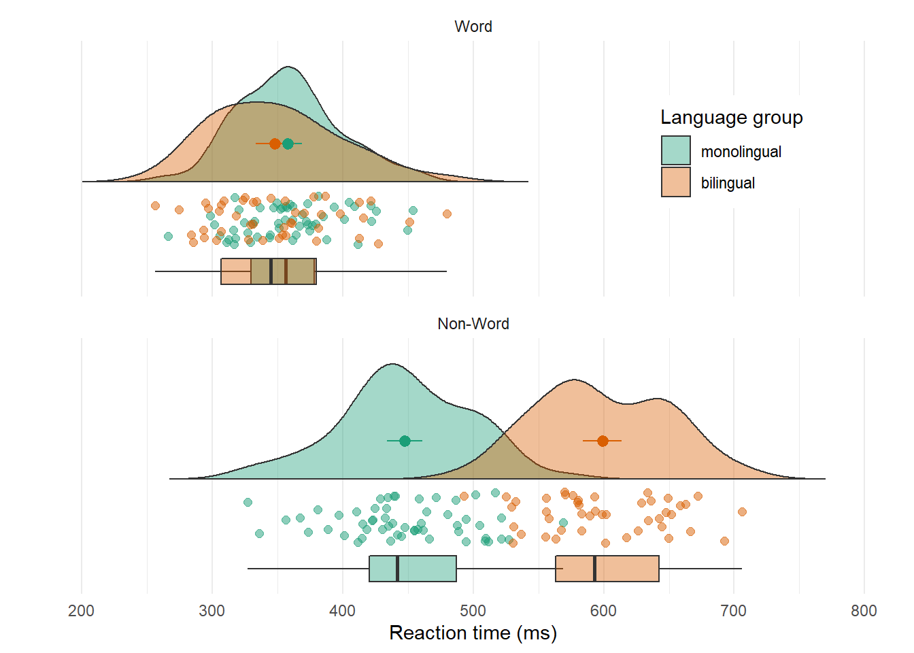

# Advanced Plots

This tutorial has but scratched the surface of the visualisation options available using R - in the additional online resources we provide some further advanced plots and customisation options for those readers who are feeling confident with the content covered in this tutorial, however, the below plots give an idea of what is possible, and represent the favourite plots of the authorship team.

We will use some custom functions: `geom_split_violin()` and `geom_flat_violin()`, which you can access through the `introdataviz` package. These functions are modified from [@raincloudplots].


```r
# how to install the introdataviz package to get split and half violin plots
devtools::install_github("psyteachr/introdataviz")
```


## Split-violin plots

Split-violin plots remove the redundancy of mirrored violin plots and make it easier to compare the distributions between multiple conditions. 


```r
ggplot(dat_long, aes(x = condition, y = rt, fill = language)) +
  introdataviz::geom_split_violin(alpha = .4, trim = FALSE) +
  geom_boxplot(width = .2, alpha = .6, show.legend = FALSE) +
  stat_summary(fun.data = "mean_se", geom = "pointrange", show.legend = F, 
               position = position_dodge(.175)) +
  scale_x_discrete(name = "Condition", labels = c("Non-word", "Word")) +
  scale_y_continuous(name = "Reaction time (ms)",
                     breaks = seq(200, 800, 100), 
                     limits = c(200, 800)) +
  scale_fill_viridis_d(option = "E", name = "Language group") +
  theme_minimal()
```

<div class="figure" style="text-align: center">

<p class="caption">(\#fig:splitviolin)Split-violin plot</p>
</div>

## Raincloud plots

Raincloud plots combine a density plot, boxplot, raw data points, and any desired summary statistics for a complete visualisation of the data. They are so called because the density plot plus raw data is reminiscent of a rain cloud. 


```r
rain_height <- .1

ggplot(dat_long, aes(x = "", y = rt, fill = language)) +
  # clouds
  introdataviz::geom_flat_violin(trim=FALSE, alpha = 0.4,
    position = position_nudge(x = rain_height+.05)) +
  # rain
  geom_point(aes(colour = language), size = 2, alpha = .5, show.legend = FALSE, 
              position = position_jitter(width = rain_height, height = 0)) +
  # boxplots
  geom_boxplot(width = rain_height, alpha = 0.4, show.legend = FALSE, 
               outlier.shape = NA,
               position = position_nudge(x = -rain_height*2)) +
  # mean and SE point in the cloud
  stat_summary(fun.data = mean_se, mapping = aes(color = language), show.legend = FALSE,
               position = position_nudge(x = rain_height * 3)) +
  # adjust layout
  scale_x_discrete(name = "", expand = c(rain_height*3, 0, 0, 0.7)) +
  scale_y_continuous(name = "Reaction time (ms)",
                     breaks = seq(200, 800, 100), 
                     limits = c(200, 800)) +
  coord_flip() +
  facet_wrap(~factor(condition, 
                     levels = c("word", "nonword"), 
                     labels = c("Word", "Non-Word")), 
             nrow = 2) +
  # custom colours and theme
  scale_fill_viridis_d(option = "E", name = "Language group") +
  scale_colour_viridis_d(option  ="E") +
  theme_minimal() +
  theme(panel.grid.major.y = element_blank(),
        legend.position = c(0.8, 0.8),
        legend.background = element_rect(fill = "white", color = "white"))
```

<div class="figure" style="text-align: center">

<p class="caption">(\#fig:raincloud)Raincloud plot</p>
</div>

## Ridge plots

Ridge plots are a series of density plots and show the distribution of numeric values for several groups. Figure\ \@ref(fig:ridgeplot) shows data from [@Nation2017] and demonstrates how effective this type of visualisation can be to convey a lot of information very intuitively whilst being visually attractive.


```r
# read in data from Nation et al. 2017
data <- read_csv("https://raw.githubusercontent.com/zonination/perceptions/master/probly.csv")

# convert to long format and percents
long <- pivot_longer(data, cols = everything(),
                     names_to = "label",
                     values_to = "prob") %>%
  mutate(label = factor(label, names(data), names(data)),
         prob = prob/100)

# ridge plot
ggplot(long, aes(x = prob, y = label, fill = label)) + 
  ggridges::geom_density_ridges(scale = 2, show.legend = FALSE) +
  scale_x_continuous(name = "Assigned Probability", 
                     limits = c(0, 1), labels = scales::percent) +
  # control space at top and bottom of plot
  scale_y_discrete(name = "", expand = c(0.02, 0, .08, 0))
```

<div class="figure" style="text-align: center">

<p class="caption">(\#fig:ridgeplot)A ridge plot.</p>
</div>

## Alluvial plots

Alluvial plots visualise multi-level categorical data through flows that can easily be traced in the diagram.


```r
library(ggalluvial)

# simulate data for 4 years of grades from 500 students
# with a correlation of 0.75 from year to year
# and a slight increase each year
dat <- faux::sim_design(
  within = list(year = c("Y1", "Y2", "Y3", "Y4")),
  n = 500,
  mu = c(Y1 = 0, Y2 = .2, Y3 = .4, Y4 = .6), r = 0.75, 
  dv = "grade", long = TRUE, plot = FALSE) %>%
  # convert numeric grades to letters with a defined probability
  mutate(grade = faux::norm2likert(grade, prob = c("3rd" = 5, "2.2" = 10, "2.1" = 40, "1st" = 20)),
         grade = factor(grade, c("1st", "2.1", "2.2", "3rd"))) %>%
  # reformat data and count each combination
  tidyr::pivot_wider(names_from = year, values_from = grade) %>%
  dplyr::count(Y1, Y2, Y3, Y4)

# plot data with colours by Year1 grades
ggplot(dat, aes(y = n, axis1 = Y1, axis2 = Y2, axis3 = Y3, axis4 = Y4)) +
  geom_alluvium(aes(fill = Y4), width = 1/6) +
  geom_stratum(fill = "grey", width = 1/3, color = "black") +
  geom_label(stat = "stratum", aes(label = after_stat(stratum))) +
  scale_fill_viridis_d(name = "Final Classification") +
  theme_minimal() +
  theme(legend.position = "top")
```

<div class="figure" style="text-align: center">

<p class="caption">(\#fig:alluvial)An alluvial plot showing the progression of student grades through the years.</p>
</div>

# Conclusion

In this tutorial we aimed to provide a practical introduction to common data visualisation techniques using R. Whilst a number of the plots produced in this tutorial can be created in point-and-click software, the underlying skill-set developed by making these visualisations is as powerful as it is extendable.

We hope that this tutorial serves as a jumping off point to encourage more researchers to adopt reproducible workflows and open-access software, in addition to beautiful data visualisations.
