# Additional customisation options

## Adding lines to plots

**Vertical Lines - geom_vline()**

Often it can be useful to put a marker into our plots to highlight a certain criterion value. For example, if you were working with a scale that has a cut-off, perhaps the Austim Spectrum Quotient 10 [@allison2012toward], then you might want to put a line at a score of 7; the point at which the researchers suggest the participant is referred further. Alternatively, thinking about the Stroop test we have looked at in this paper, perhaps you had a level of accuracy that you wanted to make sure was reached - let's say 80%. If we refer back to Figure\ \@ref(fig:histograms), which used the code below:


```r
ggplot(dat_long, aes(x = acc)) +
  geom_histogram(binwidth = 1, fill = "white", color = "black") +
  scale_x_continuous(name = "Accuracy (0-100)")
```

and displayed the spread of the accuracy scores as such:

<div class="figure" style="text-align: center">
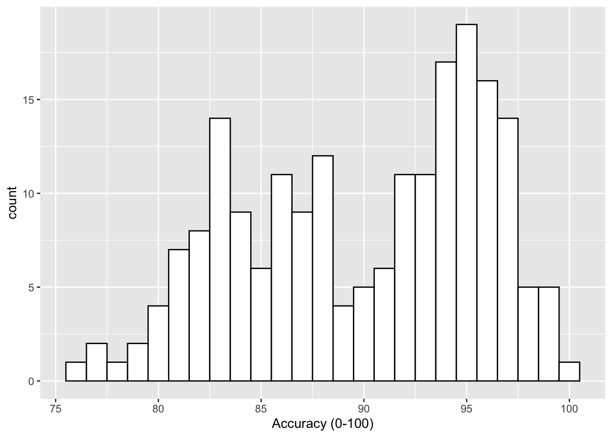
<p class="caption">(\#fig:histogram-acc-vline1)Histogram of accuracy scores.</p>
</div>

if we wanted to add a line at the 80% level then we could use the `geom_vline()` function, again from the **`ggplot2`**, with the argument of `xintercept = 80`, meaning cut the x-axis at 80, as follows:


```r
ggplot(dat_long, aes(x = acc)) +
  geom_histogram(binwidth = 1, fill = "white", color = "black") +
  scale_x_continuous(name = "Accuracy (0-100)") +
  geom_vline(xintercept = 80)
```

<div class="figure" style="text-align: center">
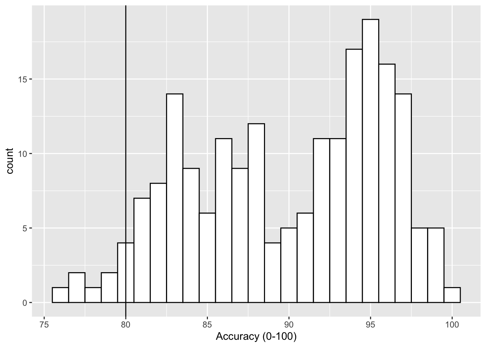
<p class="caption">(\#fig:histogram-acc-vline2)Histogram of accuracy scores with black solid vertical line indicating 80% accuracy.</p>
</div>

Now that looks ok but the line is a bit hard to see so we can change the style (`linetype = value`), color (`color = "color"`) and weight (`size = value`) as follows:


```r
ggplot(dat_long, aes(x = acc)) +
  geom_histogram(binwidth = 1, fill = "white", color = "black") +
  scale_x_continuous(name = "Accuracy (0-100)") +
  geom_vline(xintercept = 80, linetype = 2, color = "red", size = 1.5)
```

<div class="figure" style="text-align: center">
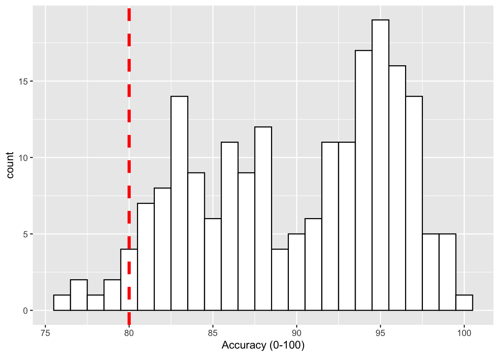
<p class="caption">(\#fig:histogram-acc-vline3)Histogram of accuracy scores with red dashed vertical line indicating 80% accuracy.</p>
</div>

**Horizontal Lines - geom_hline()**

Another situation may be that you want to put a horizontal line on your figure to mark a value of interest on the y-axis. Again thinking about our Stroop experiment, perhaps we wanted to indicate the 80% accuracy line on our boxplot figures. If we look at Figure\ \@ref(fig:boxplot1), which used this code to display the basic boxplot:


```r
ggplot(dat_long, aes(x = condition, y = acc)) +
  geom_boxplot()
```

<div class="figure" style="text-align: center">
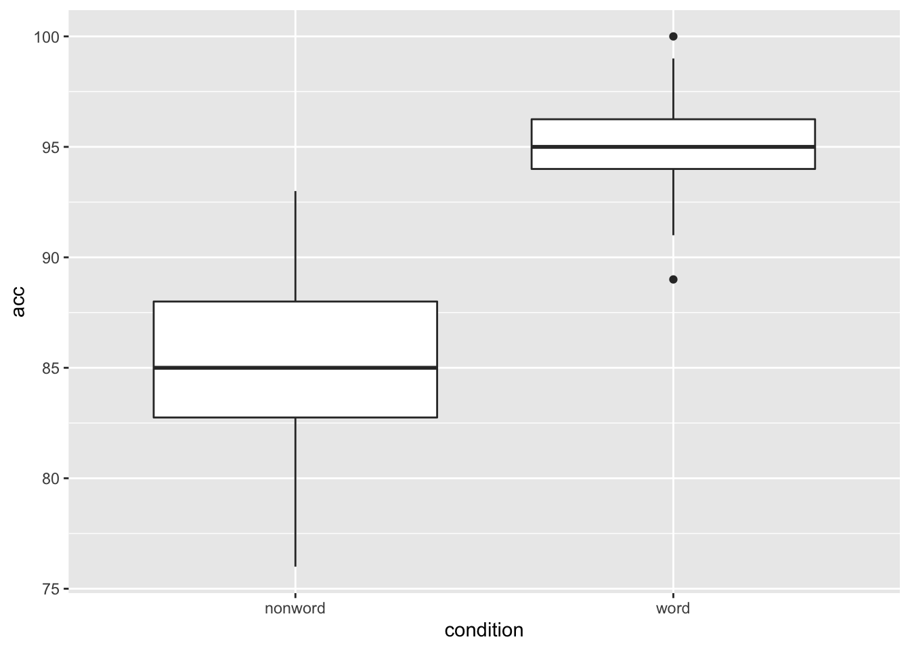
<p class="caption">(\#fig:boxplot1-add)Basic boxplot.</p>
</div>

we could then use the `geom_hline()` function, from the **`ggplot2`**, with, this time, the argument of `yintercept = 80`, meaning cut the y-axis at 80, as follows:


```r
ggplot(dat_long, aes(x = condition, y = acc)) +
  geom_boxplot() +
  geom_hline(yintercept = 80)
```

<div class="figure" style="text-align: center">
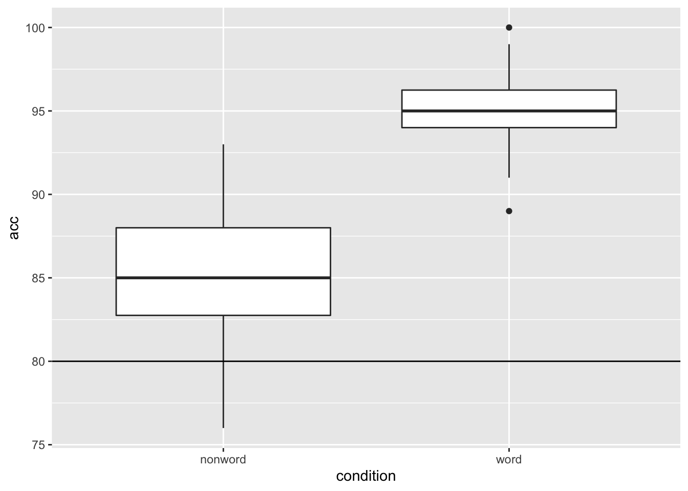
<p class="caption">(\#fig:boxplot1-hline1)Basic boxplot with black solid horizontal line indicating 80% accuracy.</p>
</div>

and again we can embellish the line using the same arguments as above. We will put in some different values here just to show the changes:


```r
ggplot(dat_long, aes(x = condition, y = acc)) +
  geom_boxplot() +
  geom_hline(yintercept = 80, linetype = 3, color = "blue", size = 2)
```

<div class="figure" style="text-align: center">
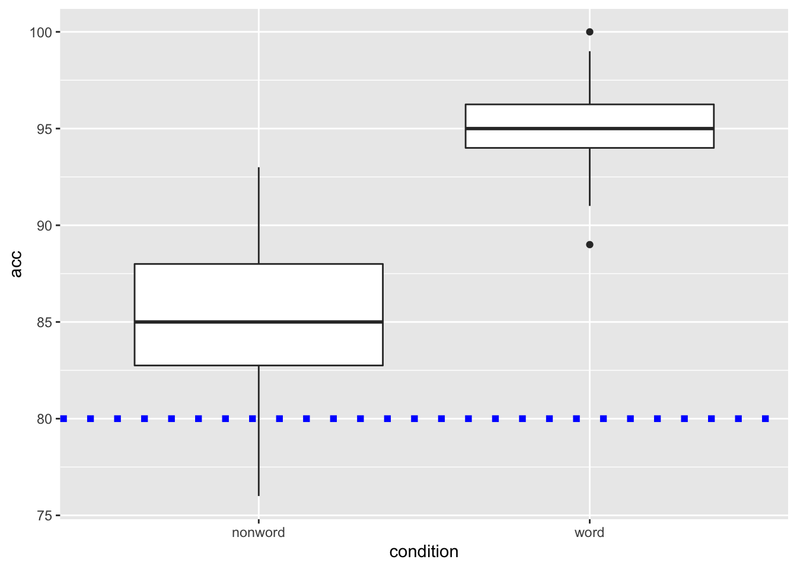
<p class="caption">(\#fig:boxplot1-hline2)Basic boxplot with blue dotted horizontal line indicating 80% accuracy.</p>
</div>

**LineTypes**

One thing worth noting is that the `linetype` argument can actually be specified as both a value or as a word. They match up as follows:

|    Value     |         Word          |
|:------------:|:---------------------:|
| linetype = 0 |  linetype = "blank"   |
| linetype = 1 |  linetype = "solid"   |
| linetype = 2 |  linetype = "dashed"  |
| linetype = 3 |  linetype = "dotted"  |
| linetype = 4 | linetype = "dotdash"  |
| linetype = 5 | linetype = "longdash" |
| linetype = 6 | linetype = "twodash"  |

**Diagonal Lines - geom_abline()**

The last type of line you might want to overlay on a figure is perhaps a diagonal line. For example, perhaps you have created a scatterplot and you want to have the true diagonal line for reference to the line of best fit. To show this, we will refer back to Figure\ \@ref(fig:smooth-plot) which displayed the line of best fit for the reaction time versus age, and used the following code:


```r
ggplot(dat_long, aes(x = rt, y = age)) +
  geom_point() +
  geom_smooth(method = "lm")
```

<div class="figure" style="text-align: center">

<p class="caption">(\#fig:smooth-plot-add)Line of best fit for reaction time versus age.</p>
</div>

By eye that would appear to be a fairly flat relationship but we will add the true diagonal to help clarify. To do this we use the `geom_abline()`, again from **`ggplot2`**, and we give it the arguements of the slope (`slope  = value`) and the intercept (`intercept = value`). We are also going to scale the data to turn it into z-scores to help us visualise the relationship better, as follows:


```r
dat_long_scale <- dat_long %>%
  mutate(rt_zscore = (rt - mean(rt))/sd(rt),
         age_zscore = (age - mean(age))/sd(age))

ggplot(dat_long_scale, aes(x = rt_zscore, y = age_zscore)) +
  geom_point() +
  geom_smooth(method = "lm") +
  geom_abline(slope = 1, intercept = 0)
```

<div class="figure" style="text-align: center">

<p class="caption">(\#fig:smooth-plot-abline1)Line of best fit (blue line) for reaction time versus age with true diagonal shown (black line).</p>
</div>

So now we can see the line of best fit (blue line) in relation to the true diagonal (black line). We will come back to why we z-scored the data in a minute, but first let's finish tidying up this figure, using some of the customisation we have seen as it is a bit messy. Something like this might look cleaner:


```r
ggplot(dat_long_scale, aes(x = rt_zscore, y = age_zscore)) +
  geom_abline(slope = 1, intercept = 0, linetype = "dashed", color = "black", size = .5) +
  geom_hline(yintercept = 0, linetype = "solid", color = "black", size = .5) +
  geom_vline(xintercept = 0, linetype = "solid", color = "black", size = .5) + 
  geom_point() +
    geom_smooth(method = "lm")
```

<div class="figure" style="text-align: center">

<p class="caption">(\#fig:smooth-plot-abline2)Line of best fit (blue solid line) for reaction time versus age with true diagonal shown (black line dashed).</p>
</div>

That maybe looks a bit cluttered but it gives a nice example of how you can use the different geoms for adding lines to add information to your figure, clearly visualising the weak relationship between reaction time and age. **Note:** Do remember about the layering system however; you will notice that in the code for Figure\ \@ref(fig:smooth-plot-abline2) we have changed the order of the code lines so that the geom lines are behind the points!

**Top Tip: Your intercepts must be values you can see**

Thinking back to why we z-scored the data for that last figure, we sort of skipped over that, but it did serve a purpose. Here is the original data and the original scatterplot but with the `geom_abline()` added to the code:


```r
ggplot(dat_long, aes(x = rt, y = age)) +
  geom_point() +
  geom_smooth(method = "lm") +
  geom_abline(slope = 1, intercept = 0)
```

<div class="figure" style="text-align: center">
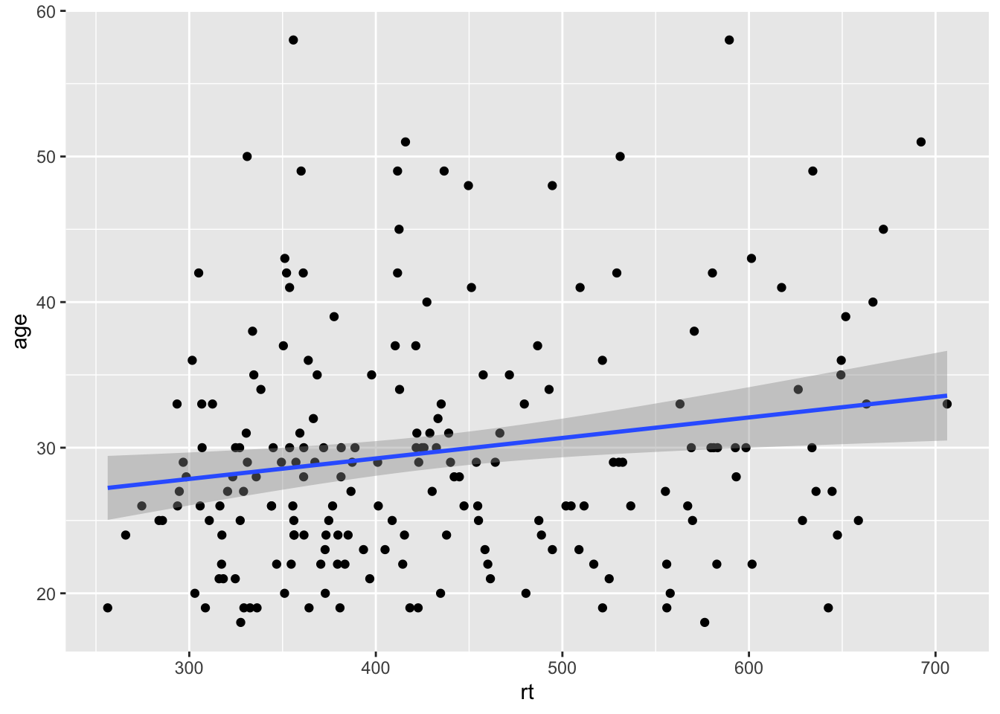
<p class="caption">(\#fig:smooth-plot-abline3)Line of best fit (blue solid line) for reaction time versus age with missing true diagonal.</p>
</div>

The code runs but the diagonal line is nowhere to be seen. The reason is that you figure is zoomed in on the data and the diagonal is "out of shot" if you like. If we were to zoom out on the data we would then see the diagonal line as such:


```r
ggplot(dat_long, aes(x = rt, y = age)) +
  geom_point() +
  geom_smooth(method = "lm") +
  geom_abline(slope = 1, intercept = 0) +
  coord_cartesian(xlim = c(0,1000), ylim = c(0,60))
```

<div class="figure" style="text-align: center">
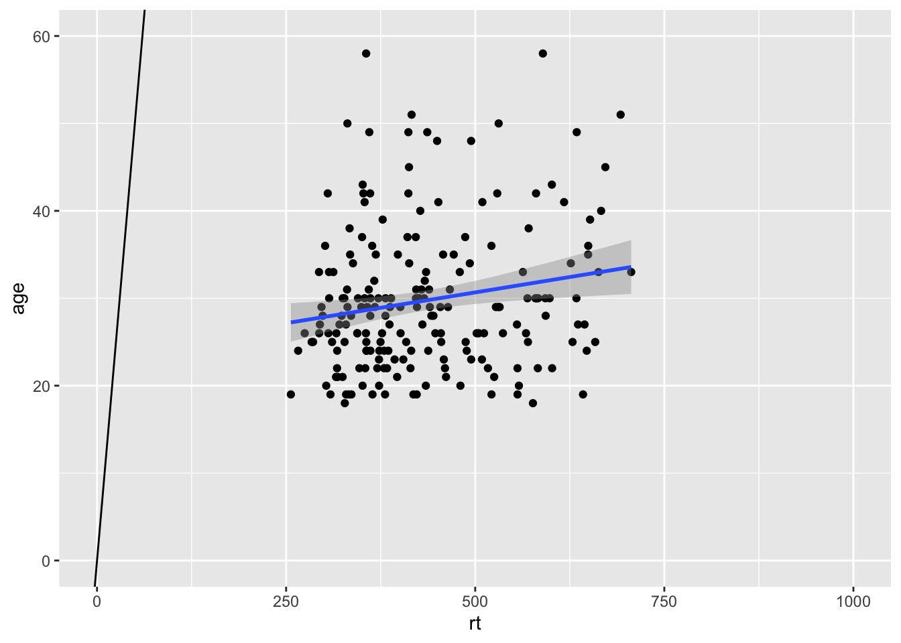
<p class="caption">(\#fig:smooth-plot-abline4)Zoomed out to show Line of best fit (blue solid line) for reaction time versus age with true diagonal (black line).</p>
</div>

So the key point is that your intercepts have to be set to visible for values for you to see them! If you run your code and the line does not appear, check that the value you have set can actually be seen on your figure. This applies to `geom_abline()`, `geom_hline()` and `geom_vline()`.

## Zooming in and out

Like in the example above, it can be very beneficial to be able to zoom in and out of figures, mainly to focus the frame on a given section. One function we can use to do this is the `coord_cartesian()`, in **`ggplot2`**. The main arguments are the limits on the x-axis (`xlim = c(value, value)`), the limits on the y-axis (`ylim = c(value, value)`), and whether to add a small expansion to those limits or not (`expand = TRUE/FALSE`). Looking at the scatterplot of age and reaction time again, we could use `coord_cartesian()` to zoom fully out:


```r
ggplot(dat_long, aes(x = rt, y = age)) +
  geom_point() +
  geom_smooth(method = "lm") +
  coord_cartesian(xlim = c(0,1000), ylim = c(0,100), expand = FALSE)
```

<div class="figure" style="text-align: center">
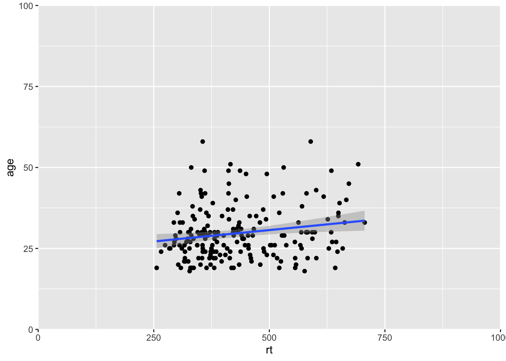
<p class="caption">(\#fig:smooth-plot-coord1)Zoomed out on scatterplot with no expansion around set limits</p>
</div>

And we can add a small expansion by changing the `expand` argument to `TRUE`:


```r
ggplot(dat_long, aes(x = rt, y = age)) +
  geom_point() +
  geom_smooth(method = "lm") +
  coord_cartesian(xlim = c(0,1000), ylim = c(0,100), expand = TRUE)
```

<div class="figure" style="text-align: center">
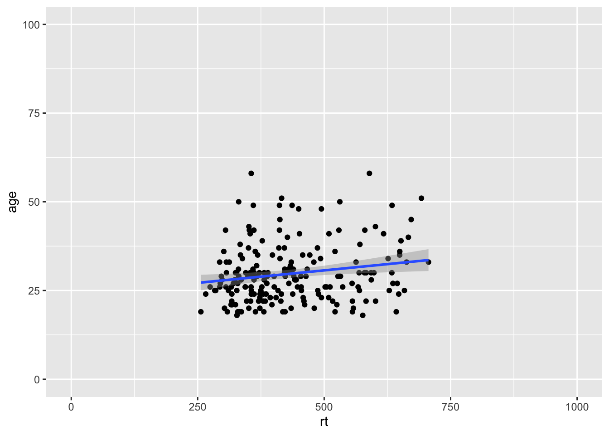
<p class="caption">(\#fig:smooth-plot-coord2)Zoomed out on scatterplot with small expansion around set limits</p>
</div>

Or we can zoom right in on a specific area of the plot if there was something we wanted to highlight. Here for example we are just showing the reaction times between 500 and 725 msecs, and all ages between 15 and 55:


```r
ggplot(dat_long, aes(x = rt, y = age)) +
  geom_point() +
  geom_smooth(method = "lm") +
  coord_cartesian(xlim = c(500,725), ylim = c(15,55), expand = TRUE)
```

<div class="figure" style="text-align: center">
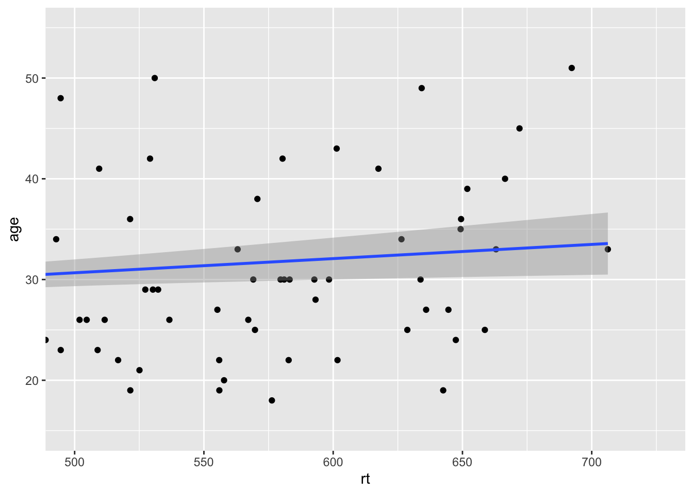
<p class="caption">(\#fig:smooth-plot-coord3)Zoomed in on scatterplot with small expansion around set limits</p>
</div>

And you can zoom in and zoom out just the x-axis or just the y-axis; just depends on what you want to show.

## Setting the axis values

**Continuous scales**

You may have noticed that depending on the spread of your data, and how much of the figure you see, the values on the axes tend to change. Often we don't want this and want the values to be constant. We have already used functions to control this in the main body of the paper - the `scale_*` functions. Here we will use `scale_x_continuous()` and `scale_y_continuous()` to set the values on the axes to what we want. The main arguments in both functions are the limits (`limts = c(value, value)`) and the breaks (the tick marks essentially, `breaks = value:value`). Note that the limits are just two values (minimum and maximum), whereas the breaks are a series of values (from 0 to 100, for example). If we use the scatterplot of age and reaction time, then our code might look like this:


```r
ggplot(dat_long, aes(x = rt, y = age)) +
  geom_point() +
  geom_smooth(method = "lm") +
  scale_x_continuous(limits = c(0,1000), breaks = 0:1000) +
  scale_y_continuous(limits = c(0,100), breaks = 0:100)
```

<div class="figure" style="text-align: center">
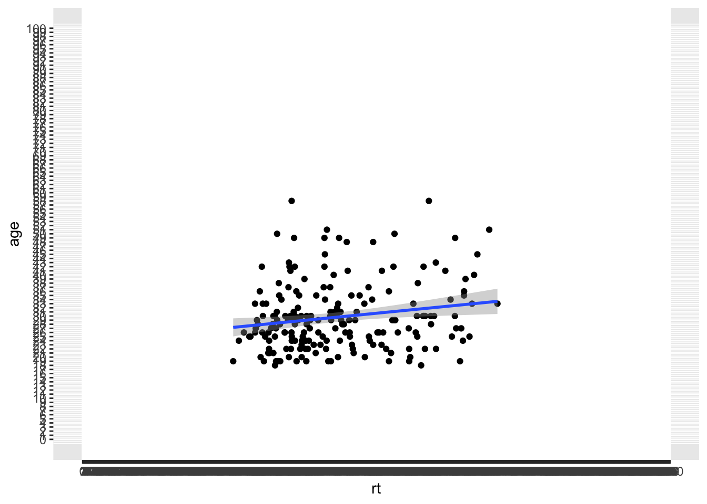
<p class="caption">(\#fig:smooth-plot-scales1)Changing the values on the axes</p>
</div>

That actually looks rubbish because we simply have too many values on our axes, so we can use the `seq()` function, from **`baseR`**, to get a bit more control. The arguments here are the first value (`from = value`), the last value (`last = value`), and the size of the steps (`by = value`). For example, `seq(0,10,2)` would give all values between 0 and 10 in steps of 2, (i.e. 0, 2, 4, 6, 8 and 10). So using that idea we can change the y-axis in steps of 5 (years) and the x-axis in steps of 50 (msecs) as follows:


```r
ggplot(dat_long, aes(x = rt, y = age)) +
  geom_point() +
  geom_smooth(method = "lm") +
  scale_x_continuous(limits = c(0,1000), breaks = seq(0,1000,50)) +
  scale_y_continuous(limits = c(0,100), breaks = seq(0,100,5))
```

<div class="figure" style="text-align: center">
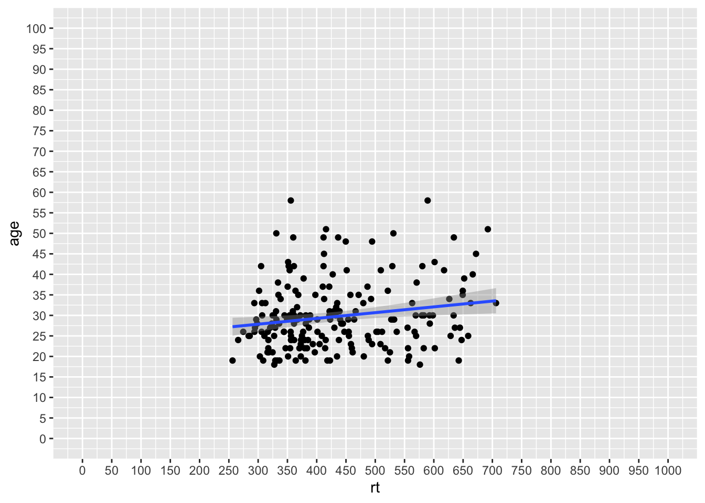
<p class="caption">(\#fig:smooth-plot-scales2)Changing the values on the axes using the seq() function</p>
</div>

Which gives us a much nicer and cleaner set of values on our axes. And if we combine that approach for setting the axes values with our zoom function (`coord_cartesian()`), then we can get something that looks like this:


```r
ggplot(dat_long, aes(x = rt, y = age)) +
  geom_point() +
  geom_smooth(method = "lm") +
  scale_x_continuous(limits = c(0,1000), breaks = seq(0,1000,50)) +
  scale_y_continuous(limits = c(0,100), breaks = seq(0,100,5)) +
  coord_cartesian(xlim = c(250,750), ylim = c(15,55))
```

<div class="figure" style="text-align: center">
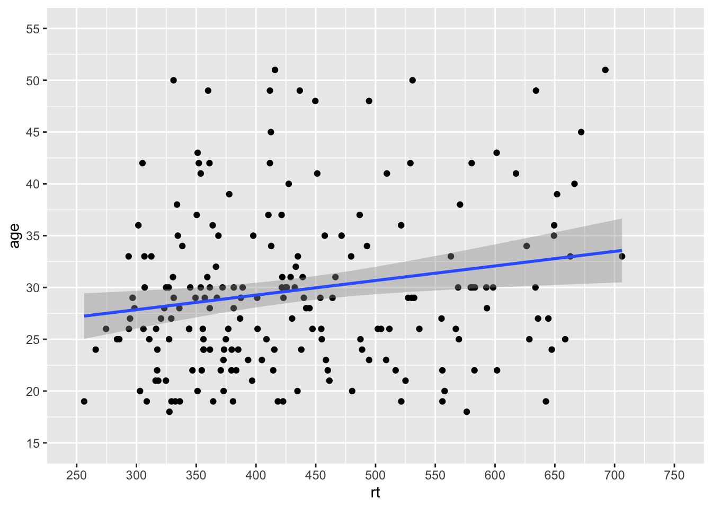
<p class="caption">(\#fig:smooth-plot-scales3)Combining scale functions and zoom functions</p>
</div>

Which actually looks much like our original scatterplot but with better definition on the axes. So you can see we can actually have a lot of control over the axes and what we see. However, one thing to note, is that you should not use the `limits` argument within the `scale_*` functions as a zoom. It won't work like that and instead will just disregard data. Look at this example:


```r
ggplot(dat_long, aes(x = rt, y = age)) +
  geom_point() +
  geom_smooth(method = "lm") +
  scale_x_continuous(limits = c(500,600))
```

```
## Warning: Removed 166 rows containing non-finite values (stat_smooth).
```

```
## Warning: Removed 166 rows containing missing values (geom_point).
```

<div class="figure" style="text-align: center">
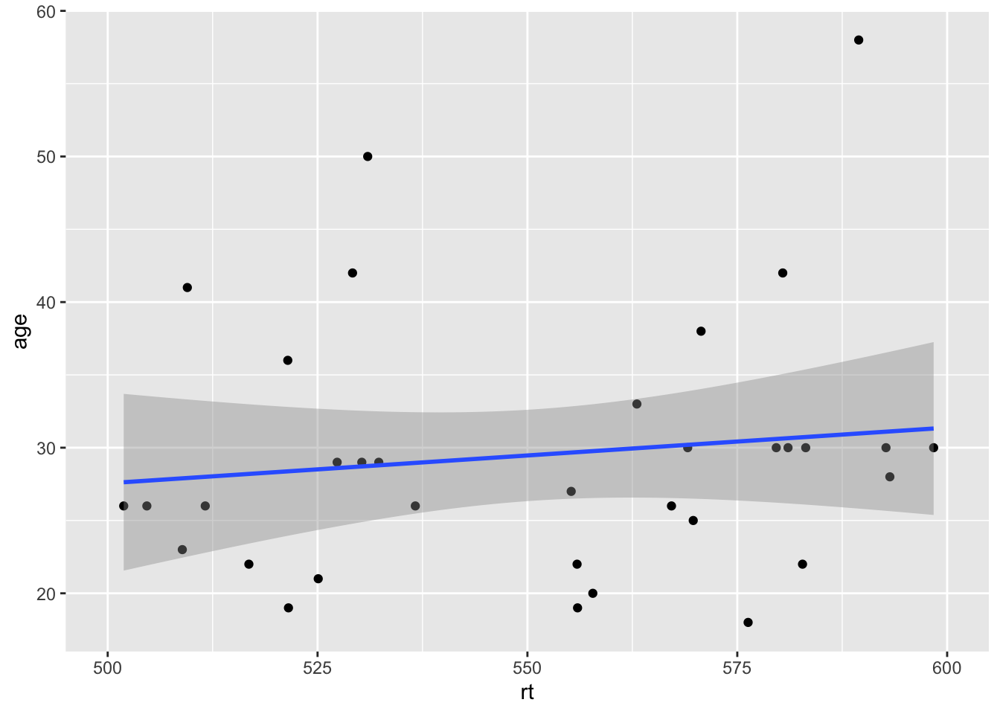
<p class="caption">(\#fig:smooth-plot-scales4)Combining scale functions and zoom functions</p>
</div>

It may look like it has zoomed in on the data but actually it has removed all data outwith the limits. That is what the warnings are telling you, and you can see that as there is no data above and below the limits, but we know there should be based on the earlier plots. So `scale_*` functions can change the values on the axes, but `coord_cartesian()` is for zooming in and out.

**Discrete scales**

The same idea of `limits` within a `scale_*` function can also be used to change the order of categories on a discrete scale. For example if we look at our boxplots again in Figure\ \@ref(fig:viobox6), we see this figure:


```r
ggplot(dat_long, aes(x = condition, y= rt, fill = condition)) +
  geom_violin(alpha = .4) +
  geom_boxplot(width = .2, fatten = NULL, alpha = .5) +
  stat_summary(fun = "mean", geom = "point") +
  stat_summary(fun.data = "mean_se", geom = "errorbar", width = .1) +
  scale_fill_viridis_d(option = "E") +
  theme_minimal()
```

<div class="figure" style="text-align: center">
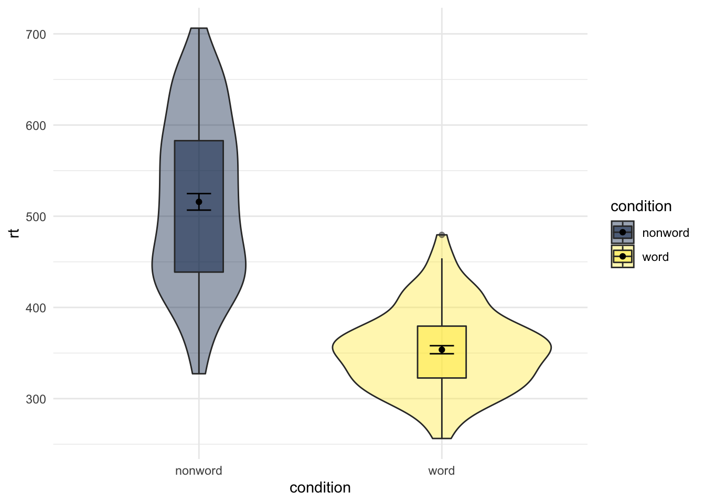
<p class="caption">(\#fig:viobox6-add)Using transparency on the fill color.</p>
</div>

The figures always default to the alphabetical order. Sometimes that is what we want; sometimes that is not what we want. If we wanted to switch the order of **word** and **non-word** so that the non-word condition comes first we would use the `scale_x_discrete()` function and set the limits within it (`limits = c("category","category")`) as follows:


```r
ggplot(dat_long, aes(x = condition, y= rt, fill = condition)) +
  geom_violin(alpha = .4) +
  geom_boxplot(width = .2, fatten = NULL, alpha = .5) +
  stat_summary(fun = "mean", geom = "point") +
  stat_summary(fun.data = "mean_se", geom = "errorbar", width = .1) +
  scale_fill_viridis_d(option = "E") +
  scale_x_discrete(limits = c("nonword","word")) + 
  theme_minimal()
```

<div class="figure" style="text-align: center">

<p class="caption">(\#fig:viobox6-scale1)Switching orders of categorical variables</p>
</div>

And that works just the same if you have more conditions, which you will see if you compare Figure\ \@ref(fig:viobox4) to the below figure where we have flipped the order of non-word and word from the original default alphabetical order


```r
ggplot(dat_long, aes(x = condition, y= rt, fill = language)) +
  geom_violin() +
  geom_boxplot(width = .2, fatten = NULL, position = position_dodge(.9)) +
  stat_summary(fun = "mean", geom = "point", 
               position = position_dodge(.9)) +
  stat_summary(fun.data = "mean_se", geom = "errorbar", width = .1,
               position = position_dodge(.9)) +
  scale_fill_viridis_d(option = "E") +
  scale_x_discrete(limits = c("nonword","word")) + 
  theme_minimal()
```

<div class="figure" style="text-align: center">
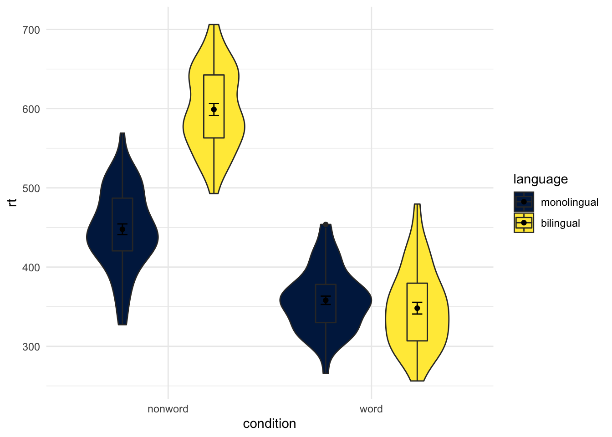
<p class="caption">(\#fig:viobox4-scale1)Same as earlier figure but with order of conditions on x-axis altered.</p>
</div>

**Changing Order of Factors**

Again, you have a lot of control beyond the default alphabetical order that **`ggplot2`** tends to plot in. One question you might have though is why **monolingual** and **bilingual** are not in alphabetical order? f they were then the **bilingual** condition would be plotted first. The answer is, thinking back to the start of the paper, we changed our conditions from **1** and **2** to the factor names of **monolingual** and **bilingual**, and **`ggplot()`** maintains that factor order when plotting. So if we want to plot it in a different fashion we need to do a bit of factor reordering. This can be done much like earlier using the `factor()` function and stating the order of conditions we want (`levels = c("factor","factor")`). But be careful with spelling as it must match up to the names of the factors that already exist.

In this example, we will reorder the factors so that **bilingual** is presented first but leave the order of **word** and **non-word** as the alphabetical default. Note in the code though that we are not permanently storing the factor change as we don't want to keep this new order. We are just changing the order "on the fly" for this one example before putting it into the plot.


```r
dat_long %>% 
  mutate(language = factor(language, 
                           levels = c("bilingual","monolingual"))) %>%
  ggplot(aes(x = condition, y= rt, fill = language)) +
  geom_violin() +
  geom_boxplot(width = .2, fatten = NULL, position = position_dodge(.9)) +
  stat_summary(fun = "mean", geom = "point", 
               position = position_dodge(.9)) +
  stat_summary(fun.data = "mean_se", geom = "errorbar", width = .1,
               position = position_dodge(.9)) +
  scale_fill_viridis_d(option = "E") +
  theme_minimal()
```

<div class="figure" style="text-align: center">
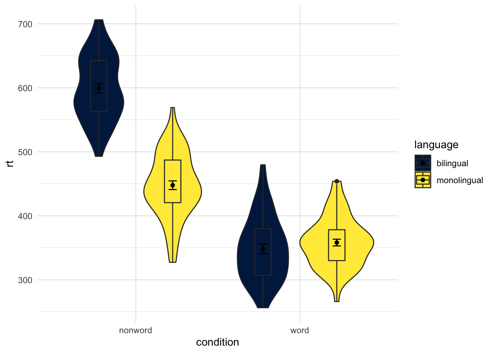
<p class="caption">(\#fig:viobox4-scale2)Same as earlier figure but with order of conditions on x-axis altered.</p>
</div>

And if we compare this new figure to the original, side-by-side, we see the difference:

<div class="figure" style="text-align: center">
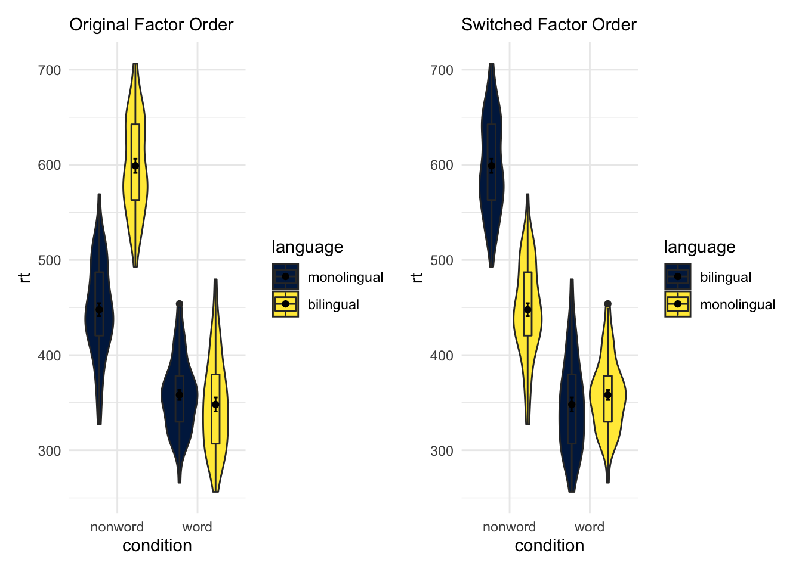
<p class="caption">(\#fig:viobox4-scale3)Switching factor orders</p>
</div>

## Controlling the Legend

**Using the `guides()`**

Whilst we are on the subject of changing order and position of elements of the figure, you might think about changing the position of a figure legend. There is actually a few ways of doing it but a simple approach is to use the the `guides()` function and add that to the ggplot chain. For example, if we run the below code and look at the output:


```r
ggplot(dat_long, aes(x = condition, y= rt, fill = condition)) +
  geom_violin(alpha = .4) +
  geom_boxplot(width = .2, fatten = NULL, alpha = .5) +
  stat_summary(fun = "mean", geom = "point") +
  stat_summary(fun.data = "mean_se", geom = "errorbar", width = .1) +
  scale_fill_viridis_d(option = "E") +
  guides(fill = "none") +
  theme_minimal()
```

<div class="figure" style="text-align: center">

<p class="caption">(\#fig:viobox6-legend1)Figure Legend removed using `guides()`</p>
</div>

We see the same display as Figure\ \@ref(fig:viobox6-add) but with no legend. That is quite useful because the legend just repeats the x-axis and becomes redundant. The `guides()` function works but setting the legened associated with the `fill` layer (i.e. `fill = condition`) to `"none"`, basically removing it. One thing to note with this approach is that you need to set a guide for every legend, otherwise a legend will appear. What that means is that if you had set both `fill = condition` and `color = condition`, then you would need to set both `fill` and `color` to `"none"` within `guides()` as follows:


```r
ggplot(dat_long, aes(x = condition, y= rt, fill = condition, color = condition)) +
  geom_violin(alpha = .4) +
  geom_boxplot(width = .2, fatten = NULL, alpha = .5) +
  stat_summary(fun = "mean", geom = "point") +
  stat_summary(fun.data = "mean_se", geom = "errorbar", width = .1) +
  scale_fill_viridis_d(option = "E") +
  guides(fill = "none", color = "none") +
  theme_minimal()
```

<div class="figure" style="text-align: center">

<p class="caption">(\#fig:viobox6-legend2)Removing more than one legend with `guides()`</p>
</div>

Whereas if you hadn't used `guides()` you would see the following:


```r
ggplot(dat_long, aes(x = condition, y= rt, fill = condition, color = condition)) +
  geom_violin(alpha = .4) +
  geom_boxplot(width = .2, fatten = NULL, alpha = .5) +
  stat_summary(fun = "mean", geom = "point") +
  stat_summary(fun.data = "mean_se", geom = "errorbar", width = .1) +
  scale_fill_viridis_d(option = "E") +
  theme_minimal()
```

<div class="figure" style="text-align: center">

<p class="caption">(\#fig:viobox6-legend3)Figure with more than one Legend</p>
</div>

The key thing to note here is that in the above figure there is actually two legends (one for `fill` and one for `color`) but they are overlaid on top of each other as they are associated with the same variable. You can test this by removing either one of the options from the `guides()` function. One of the legends will still remain. So you need to turn them both off or you can use it to leave certain parts clear.

**Using the `theme()`**

An alternative to the guides function is using the `theme()` function. The `theme()` function can actually be used to control a whole host of options in the plot, which we will come on to, but you can use it as a quick way to turn off the legend as follows:


```r
ggplot(dat_long, aes(x = condition, y= rt, fill = condition, color = condition)) +
  geom_violin(alpha = .4) +
  geom_boxplot(width = .2, fatten = NULL, alpha = .5) +
  stat_summary(fun = "mean", geom = "point") +
  stat_summary(fun.data = "mean_se", geom = "errorbar", width = .1) +
  scale_fill_viridis_d(option = "E") +
  theme_minimal() +
  theme(legend.position = "none")
```

<div class="figure" style="text-align: center">

<p class="caption">(\#fig:viobox6-legend4)Removing the legend with `theme()`</p>
</div>

What you can see is that within the `theme()` function we set an argument for `legend.position` and we set that to `"none"` - again removing the legend entirely. One difference to note here is that it removes all aspects of the legend where as, as we said, using `guides()` allows you to control different parts of the legend (either leaving the `fill` or `color` showing or both). So using the `legend.position = "none"` is a bit more brute force and can be handy when you are using various different means of distinguishing between conditions of a variable and don't want to have to remove each aspect using the `guides()`.

An extension here of course is not just removing the legend, but moving the legend to a different position. This can be done by setting `legend.position = ...` to either `"top"`, `"bottom"`, `"left"` or `"right"` as shown:

<div class="figure" style="text-align: center">
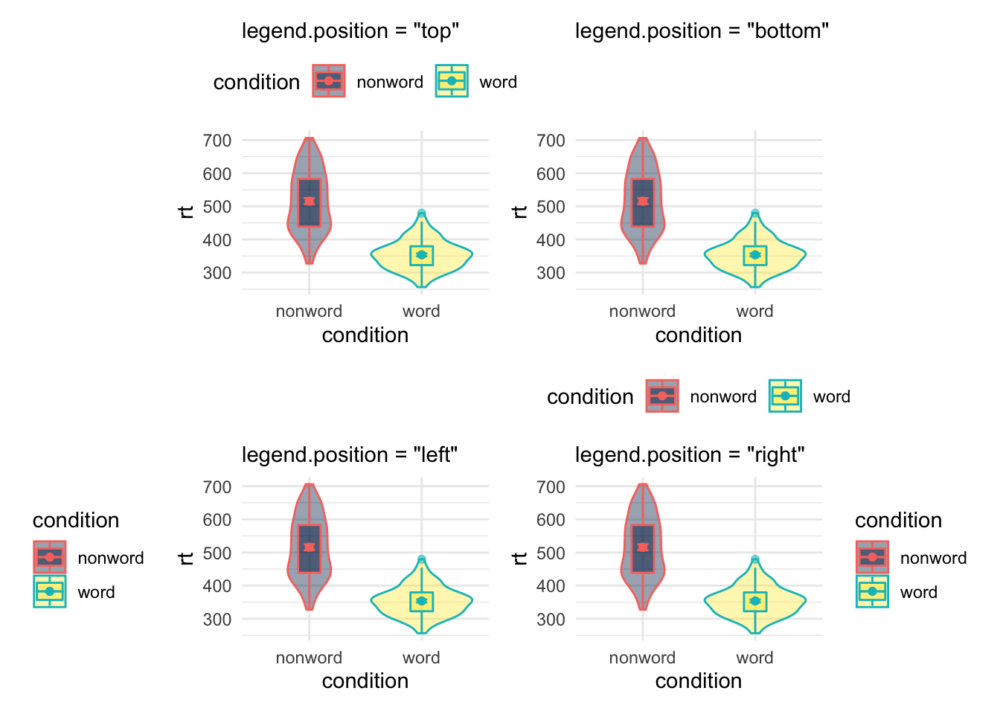
<p class="caption">(\#fig:viobox6-legend5)Legend position options using theme()</p>
</div>

Or even as a coordinate within your figure expressed as a propotion of your figure - i.e. c(x = 0, y = 0) would be the bottom left of your figure and c(x = 1, y = 1) would be the top right, as shown here:

<div class="figure" style="text-align: center">

<p class="caption">(\#fig:viobox6-legend6)Legend position options using theme()</p>
</div>

And so with a little trial and error you can position your legend where you want it without crashing into your figure, hopefully!

## Setting A Lab Theme using `theme()`

The `theme()` function, as we mentioned, does a lot more than just change the position of a legend and can be used to really control a variety of elements and to eventually create your own "theme" for your figures - say you want to have a consistent look to your figures across your publications or across your lab posters. We will try to show some of that here, but first lets start with a very basic plot that we have seen before:

**THIS BIT NEEDS WORK**


```r
# set up custom theme to add to all plots
mytheme <- theme_minimal(     # always start with a base theme_****
  base_size = 16,             # 16-point font (adjusted for axes)
  base_family = "Helvetica"   # font style
) +                           # add more specific customisations with theme()
theme(
  text             = element_text(color = "white"),  # most text
  axis.text        = element_text(color = "grey60"), # axis label text
  axis.line        = element_line(color = "grey60"), # x and y axes
  plot.background  = element_rect(fill = "black"),   # main background
  panel.background = element_blank(),                # defaults to plot background fill
  panel.grid       = element_blank()                 # get rid of gridlines
)

# plot with custom theme
ggplot(diamonds, aes(carat, price, color = cut)) +
  geom_smooth() + 
  mytheme
```

<div class="figure" style="text-align: center">
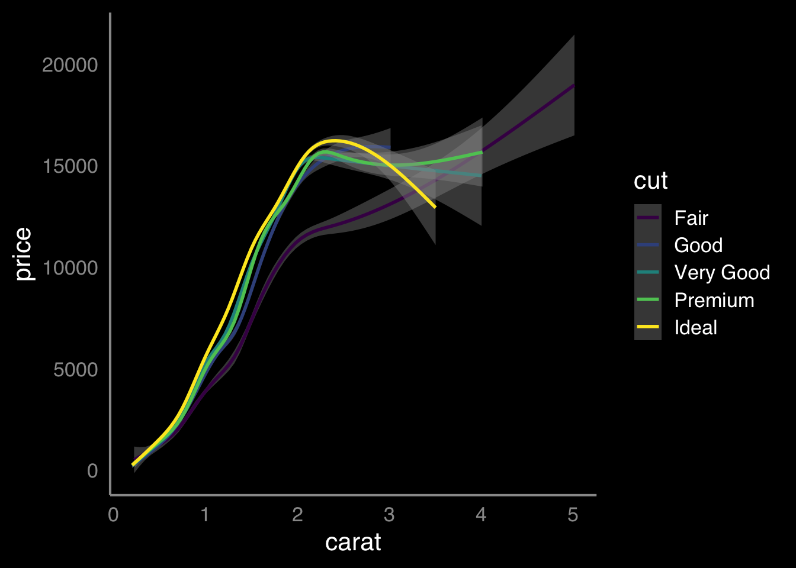
<p class="caption">(\#fig:unnamed-chunk-1)buidling something like this idea</p>
</div>

