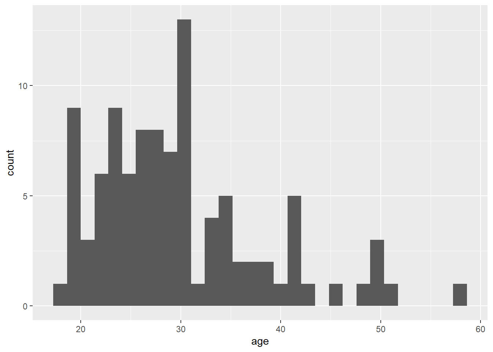
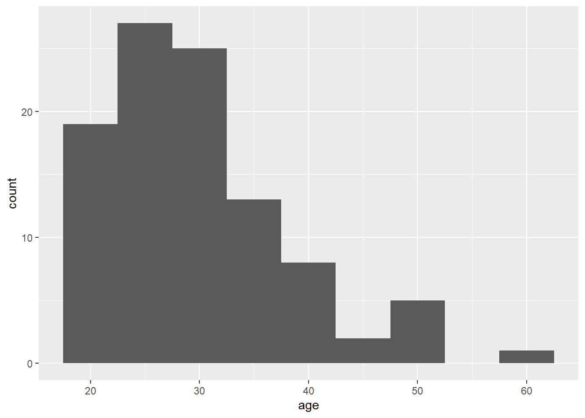
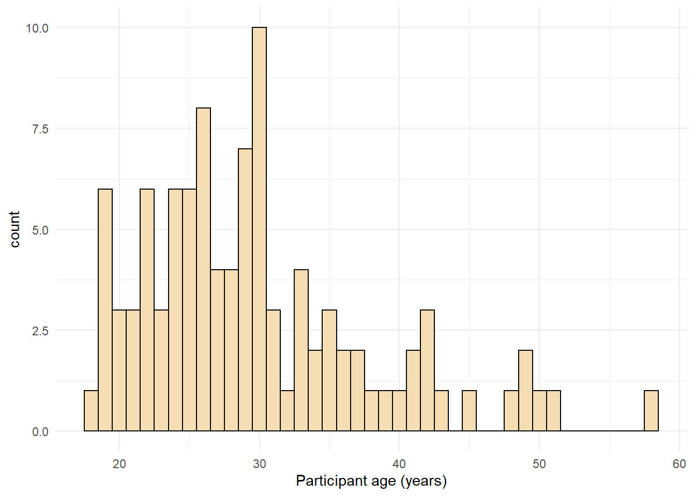

# Getting Started

## Loading packages

To load the packages that have the functions we need, use the `library()` function. Whilst you only need to install packages once, you need to load any packages you want to use with `library()` every time you start R or start a new session. When you load the `tidyverse`, you actually load several separate packages that are all part of the same collection and have been designed to work well together. R will produce a message that tells you the names of all the packages that have been loaded.

``` r
library(tidyverse)
library(patchwork)
```

## Loading data

To load the [simulated sata](https://osf.io/bj83f/files/){target="_blank"} we use the function `read_csv()` from the `readr` tidyverse package. Note that there are many other ways of reading data into R, but the benefit of this function is that it enters the data into the R environment in such a way that it makes most sense for other tidyverse packages.


```r
dat <- read_csv(file = "ldt_data.csv")
```

This code has created an object `dat` into which you have read the data from the file `ldt_data.csv`. This object will appear in the environment pane in the top right. Note that the name of the data file must be in quotation marks and the file extension (`.csv`) must also be included. If you receive the error `…does not exist in current working directory` it is highly likely that you have made a typo in the file name (remember R is case sensitive), have forgotten to include the file extension `.csv`, or that the data file you want to load is not stored in your project folder. If you get the error `could not find function` it means you have either not loaded the correct package (a common beginner error is to write the code, but not run it), or you have made a typo in the function name.

To view the dataset, click `dat` in the environment pane or run `View(dat)` in the console. The environment pane also tells us that the object `dat` has 100 observations of 7 variables, and this is a useful quick check to ensure one has loaded the right data. Note that the 7 variables have an additional piece of information `chr` and `num`; this specifies the kind of data in the column. Similar to Excel and SPSS, R used this information (or variable type) to specify allowable manipulations of data. For instance character data such as the `id` cannot be averaged, while it is possible to do this with numerical data such as the `age`.

## Handling numeric factors

Another useful check is to use the functions `summary()` and `str()` (structure) to check what kind of data R thinks is in each column. Run the below code and look at the output of each, comparing it with what you know about the simulated dataset:


```r
summary(dat)
str(dat)        
```

Because the factor `language` is coded as 1 and 2, R has categorised this column as containing numeric information and unless we correct it, this will cause problems for visualisation and analysis. The code below shows how to recode numeric codes into labels. 

* `mutate()` makes new columns in a data table, or overwrites a column;
* `factor()` translates the language column into a factor with the labels "monolingual" and "bilingual". You can also use `factor()` to set the display order of a column that contains words. Otherwise, they will display in alphabetical order. In this case we are replacing the numeric data (1 and 2) in the `language` column with the equivalent English labels `monolingual` for 1 and `bilingual` for 2. At the same time we will change the column type to be a factor, which is how R defines categorical data.


```r
dat <- dat %>%
  mutate(language = factor(
    x = language, # column to translate
    levels = c(1, 2), # values of the original data in preferred order
    labels = c("monolingual", "bilingual") # labels for display
  ))
```

Make sure that you always check the output of any code that you run. If after running this code `language` is full of `NA` values, it means that you have run the code twice. The first time would have worked and transformed the values from `1` to `monolingual` and `2` to `bilingual`. If you run the code again on the same dataset, it will look for the values `1` and `2`, and because there are no longer any that match, it will return NA. If this happens, you will need to reload the dataset from the csv file.

A good way to avoid this is never to overwrite data, but to always store the output of code in new objects (e.g., `dat_recoded`) or new variables (`language_recoded`). For the purposes of this tutorial, overwriting  provides a useful teachable moment so we'll leave it as it is.

## Argument names

Each function has a list of arguments it can take, and a default order for those arguments. You can get more information on each function by entering `?function_name` into the console, although be aware that learning to read the help documentation in R is a skill in itself. When you are writing R code, as long as you stick to the default order, you do not have to explicitly call the argument names, for example, the above code could also be written as:


```r
dat <- dat %>%
  mutate(language = factor(language, 
                           c(1, 2), 
                           c("monolingual", "bilingual")))
```

One of the challenges in learning R is that many of the "helpful" examples and solutions you will find online do not include argument names and so for novice learners are completely opaque. In this tutorial, we will include the argument names the first time a function is used, however, we will remove some argument names from subsequent examples to facilitate knowledge transfer to the help available online.


## Demographic information

You can calculate and plot some basic descriptive information about the demographics of our sample using the imported dataset without any additional wrangling (or data processing). The code below uses the `%>%` operator, otherwise known as the *pipe,* and can be translated as "*and then"*. For example, the below code can be read as:

-   Start with the dataset `dat` *and then;*

-   Group it by the variable `language` *and then;*

-   Count the number of observations in each group


```r
dat %>%
  group_by(language) %>%
  count()
```


|  language   | n  |
|:-----------:|:--:|
| monolingual | 55 |
|  bilingual  | 45 |


`group_by()` does not result in surface level changes to the dataset, rather, it changes the underlying structure so that if groups are specified, whatever function is called next is performed separately on each level of the grouping variable. The above code therefore counts the number of observations in each group of the variable `language`. If you just need the total number of observations, you could remove the `group_by()` line which would perform the operation on the whole dataset, rather than by groups:


```r
dat %>%
  count()
```


|  n  |
|:---:|
| 100 |

Similarly, we may wish to calculate the mean age (and SD) of the sample and we can do so using the function `summarise()` from the `dplyr` tidyverse package.


```r
dat %>%
  summarise(mean_age = mean(age),
            sd_age = sd(age),
            n_values = n())
```


| mean_age | sd_age | n_values |
|:--------:|:------:|:--------:|
|  29.75   |  8.28  |   100    |

This code produces summary data in the form of a column named `mean_age` that contains the result of calculating the mean of the variable `age`. It then creates `sd_age` which does the same but for standard deviation. Finally, it uses the function `n()` to add the number of values used to calculate the statistic in a column named `n_values` - this is a useful sanity check whenever you make summary statistics.


Note that the above code will not save the result of this operation, it will simply output the result in the console. If you wish to save it for future use, you can store it in an object by using the `<-` notation and print it later by typing the object name.


```r
age_stats <- dat %>%
  summarise(mean_age = mean(age),
            sd_age = sd(age),
            n_values = n())
```

Finally, the `group_by()` function will work in the same way when calculating summary statistics - the output of the function that is called after `group_by()` will be produced for each level of the grouping variable.


```r
dat %>%
  group_by(language) %>%
  summarise(mean_age = mean(age),
            sd_age = sd(age),
            n_values = n())
```


|  language   | mean_age | sd_age | n_values |
|:-----------:|:--------:|:------:|:--------:|
| monolingual |  27.96   |  6.78  |    55    |
|  bilingual  |  31.93   |  9.44  |    45    |

## Bar chart of counts

For our first plot, we will make a simple bar chart of counts that shows the number of participants in each `language` group.


```r
ggplot(data = dat, mapping = aes(x = language)) +
  geom_bar()
```

<div class="figure" style="text-align: center">

<p class="caption">(\#fig:bar1)Bar chart of counts.</p>
</div>

The first line of code sets up the base of the plot.

-   `data` specifies which data source to use for the plot

-   `mapping` specifies which variables to map to which aesthetics (`aes`) of the plot. Aesthetic mappings describe how variables in the data are mapped to visual properties (aesthetics) of geoms.

-   `x` specifies which variable to put on the x-axis

The second line of code adds a `geom`, and is connected to the base code with `+`. In this case, we ask for `geom_bar()`. Each `geom` has an associated default statistic. For `geom_bar()`, the default statistic is to count the data passed to it. This means that you do not have to specify a `y` variable when making a bar plot of counts; when given an `x` variable `geom_bar()` will automatically calculate counts of the groups in that variable. In this example, it counts the number of data points that are in each category of the `language` variable.

The base layer and the geoms you add as layers work in symbiosis so it is worthwhile checking the mapping rules as these are related to the default statistic for the plot's geom.

## Plotting existing aggregates and percent

If your data already have the counts that you want to plot, you can set `stat="identity"` inside of `geom_bar()` to use that number instead of counting rows. For example, there is currently no function to plot percentages rather than counts within `ggplot`, you need to calculate these and store them in an object which is then used as the dataset. 

Notice that we are now omitting the names of the arguments `data` and `mapping` in the `ggplot()` function.


```r
dat_percent <- dat %>%
  group_by(language) %>%
  count() %>%
  ungroup() %>%
  mutate(percent = (n/sum(n)*100))

ggplot(dat_percent, aes(x = language, y = percent)) +
  geom_bar(stat="identity") 
```

<div class="figure" style="text-align: center">

<p class="caption">(\#fig:bar-precalc)Bar chart of pre-calculated counts.</p>
</div>


## Histogram

The code to plot a histogram of `age` is very similar to the code used for the bar chart. We start by setting up the plot space, the dataset we want to use, and mapping the variables to the relevant axis. In this case, we want to plot a histogram with `age` on the x-axis:


```r
ggplot(dat, aes(x = age)) +
  geom_histogram()
```

<div class="figure" style="text-align: center">

<p class="caption">(\#fig:histogram1)Histogram of ages.</p>
</div>

The base statistic for `geom_histogram()` is also count, and by default `geom_histogram()` divides the x-axis into "bins" and counts how many observations are in each bin and so the y-axis does not need to be specified. When you run the code to produce the histogram, you will get the message `stat_bin() using bins = 30. Pick better value with binwidth`. This means that the default number of bins `geom_histogram()` divided the x-axis into is 30. For our data that looks appropriate, but for example, if you want one bar to equal 5 years, you can adjust `binwidth = 5`.


```r
ggplot(dat, aes(x = age)) +
  geom_histogram(binwidth = 5)
```

<div class="figure" style="text-align: center">

<p class="caption">(\#fig:histogram2)Histogram of ages where each bin covers five years.</p>
</div>

## Customisation 1

So far we have made basic plots with the default visual appearance. Before we move on to the experimental data we will introduce some simple visual customisation options. There are many ways in which you can control or customise the visual appearance of figures in R. However, once you understand the logic of one, it becomes easier to understand others that you may see in other examples. Visual appearance of elements can be customised within a geom itself, within the aesthetic mapping, or by connecting additional layers with `+`. In this section we look at the simplest and most commonly-used customisations: changing colours, adding axis labels, and adding themes.

### Changing colours

For our basic bar chart, you can control colours used to display the bars by setting `fill` (internal colour)  and `colour` (outline colour) inside the geom function. This methods changes **all** the bars; we will show you later how to set fill or colour separately for different groups.


```r
ggplot(dat, aes(age)) +
  geom_histogram(binwidth = 1, 
                 fill = "white", 
                 colour = "black")
```

<div class="figure" style="text-align: center">

<p class="caption">(\#fig:histogram-fill-color)Histogram with custom colors for bar fill and line colors.</p>
</div>

### Editing axis names and labels

To edit axis names and labels you can connect `scale_*` functions to your plot with `+` to add layers. These functions are part of `ggplot` and the one you use depends on which aesthetic you wish to edit (e.g., x-axis, y-axis, fill, colour) as well as the type of data it represents (discrete, continuous).

For the bar chart of counts, the x-axis is mapped to a discrete (categorical) variable whilst the y-axis is continuous. For each of these there is a relevant scale function with various elements that can be customised.  Each axis then has its own function added as a layer to the basic plot. 


```r
ggplot(dat, aes(language)) +
  geom_bar() +
  scale_x_discrete(name = "Language group", 
                   labels = c("Monolingual", "Bilingual")) +
  scale_y_continuous(name = "Number of participants",
                     breaks = c(0,10,20,30,40,50))
```

<div class="figure" style="text-align: center">

<p class="caption">(\#fig:bar3)Bar chart with custom axis labels.</p>
</div>

-   `name` controls the overall name of the axis (note the use of quotation marks)

-   `labels` controls the names of the conditions with a discrete variable.

-   `c()` is a function that you will see in many different contexts and is used to combine multiple values. In this case, the labels we want to apply are combined within `c()` by enclosing each word within their own parenthesis, and are in the order displayed on the plot. A very common error is to forget to enclose multiple values in `c()`.

-   `breaks` controls the tick marks on the axis. Again because there are multiple values, they are enclosed within `c()` although because they are numeric and not text, they do not need quotation marks. 

### Discrete vs. continuous errors

Another very common error is to map the wrong type of `scale_` function to a variable. Try running the below code:


```r
# produces an error
ggplot(dat, aes(language)) +
  geom_bar() +
  scale_x_continuous(name = "Language group", 
                   labels = c("Monolingual", "Bilingual")) 
```

This will produce the error `Discrete value supplied to continuous scale` because we have used a `continuous` scale function, despite the fact that x-axis variable is discrete. If you get this error (or the reverse), check the type of data on each axis and the function you have used. 

### Adding a theme

`ggplot` has a number of built-in visual themes that you can apply as an extra layer. The below code updates the x-axis and y-axis labels to the histogram, but also applies `theme_minimal()`. Each part of a theme can be independently customised, which may be necessary, for example, if you have journal guidelines on fonts for publication. There are further instructions for how to do this in the additional resources.


```r
ggplot(dat, aes(age)) +
  geom_histogram(binwidth = 1, fill = "wheat", color = "black") +
  scale_x_continuous(name = "Participant age (years)") +
  theme_minimal()
```

<div class="figure" style="text-align: center">

<p class="caption">(\#fig:histogram-theme)Histogram with a custom theme.</p>
</div>

You can set the theme globally so that all subsequent plots use a theme.


```r
theme_set(theme_minimal())
```

If you wished to return to the default theme, change the above to specify `theme_grey()`.

## Activities 1

Before you move on try the following:

1. Add a layer that edits the **name** of the y-axis histogram label to `Number of participants`.


<div class='webex-solution'><button>Solution 1</button>


```r
ggplot(dat, aes(age)) +
  geom_histogram(binwidth = 1, fill = "wheat", color = "black") +
  scale_x_continuous(name = "Participant age (years)") +
  theme_minimal() +
  scale_y_continuous(name = "Number of participants")
```

</div>


2.  Change the colour of the bars in the bar chart to red.


<div class='webex-solution'><button>Solution 2</button>


```r
ggplot(data = dat, mapping = aes(x = language)) +
  geom_bar(fill = "red")
```

</div>


3.   Remove `theme_minimal()` from the histogram and instead apply one of the other available themes. To find out about other available themes, start typing `theme_` and the auto-complete will show you the available options - this will only work if you have loaded the `tidyverse` library with `library(tidyverse)`.


<div class='webex-solution'><button>Solution 3</button>


```r
#multiple options here e.g., theme_classic()
ggplot(dat, aes(age)) +
  geom_histogram(binwidth = 1, fill = "wheat", color = "black") +
  scale_x_continuous(name = "Participant age (years)") +
  theme_classic()

# theme_bw()
ggplot(dat, aes(age)) +
  geom_histogram(binwidth = 1, fill = "wheat", color = "black") +
  scale_x_continuous(name = "Participant age (years)") +
  theme_bw()
```

</div>


