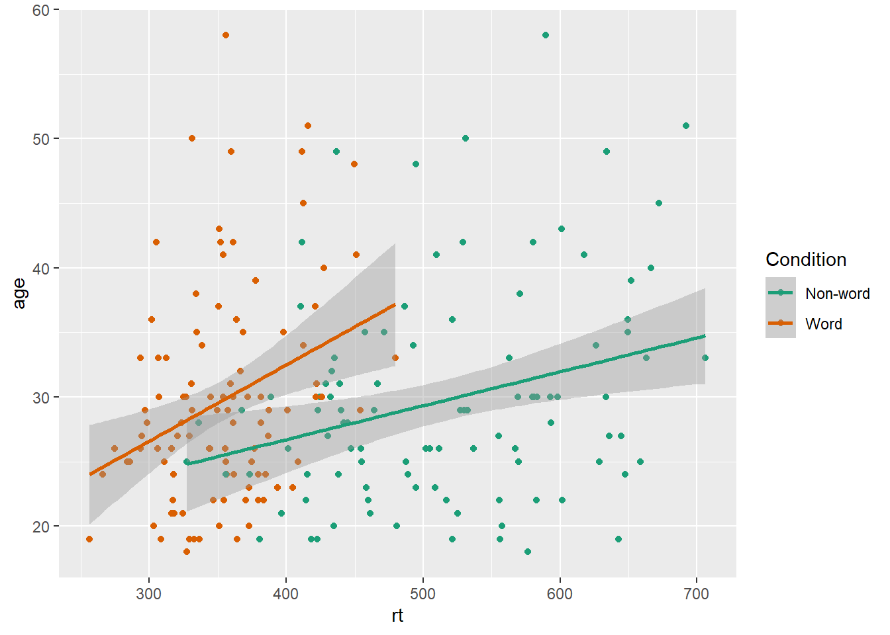

# Transforming Data

## Data formats

To visualise the experimental reaction time and accuracy data using `ggplot2`, we first need to reshape the data from wide format to long format. This step can cause friction with novice users of R. Traditionally, psychologists have been taught data skills using wide-format data. Wide-format data typically has one row of data for each participant, with separate columns for each score or variable. For repeated-measures variables, the dependent variable is split across different columns. For between-groups variables, a separate column is added to encode the group to which a participant or observation belongs. 

The simulated lexical decision data is currently in wide format (see Table\ \@ref(tab:wide-data)), where each participant's aggregated [^3] reaction time and accuracy for each level of the within-subject variable is split across multiple columns for the repeated factor of conditon (words versus non-words).

[^3]: In this tutorial we have chosen to gloss over the data processing steps that must occur to get from the raw data to aggregated values. This type of processing requires a more extensive tutorial than we can provide in the current paper. More importantly, it is still possible to use R for data visualisation having done the preparatory steps using existing workflows in Excel and SPSS. We bypass these initial steps and focus on tangible outputs that may then encourage further mastery of reproducible methods. Collectively we tend to call the steps for reshaping data and for processing raw data or for getting data ready to use statistical functions "wrangling".

<table>
<caption>(\#tab:wide-data)Data in wide format.</caption>
 <thead>
  <tr>
   <th style="text-align:left;"> id </th>
   <th style="text-align:right;"> age </th>
   <th style="text-align:left;"> language </th>
   <th style="text-align:right;"> rt_word </th>
   <th style="text-align:right;"> rt_nonword </th>
   <th style="text-align:right;"> acc_word </th>
   <th style="text-align:right;"> acc_nonword </th>
  </tr>
 </thead>
<tbody>
  <tr>
   <td style="text-align:left;"> S001 </td>
   <td style="text-align:right;"> 22 </td>
   <td style="text-align:left;"> monolingual </td>
   <td style="text-align:right;"> 379.46 </td>
   <td style="text-align:right;"> 516.82 </td>
   <td style="text-align:right;"> 99 </td>
   <td style="text-align:right;"> 90 </td>
  </tr>
  <tr>
   <td style="text-align:left;"> S002 </td>
   <td style="text-align:right;"> 33 </td>
   <td style="text-align:left;"> monolingual </td>
   <td style="text-align:right;"> 312.45 </td>
   <td style="text-align:right;"> 435.04 </td>
   <td style="text-align:right;"> 94 </td>
   <td style="text-align:right;"> 82 </td>
  </tr>
  <tr>
   <td style="text-align:left;"> S003 </td>
   <td style="text-align:right;"> 23 </td>
   <td style="text-align:left;"> monolingual </td>
   <td style="text-align:right;"> 404.94 </td>
   <td style="text-align:right;"> 458.50 </td>
   <td style="text-align:right;"> 96 </td>
   <td style="text-align:right;"> 87 </td>
  </tr>
  <tr>
   <td style="text-align:left;"> S004 </td>
   <td style="text-align:right;"> 28 </td>
   <td style="text-align:left;"> monolingual </td>
   <td style="text-align:right;"> 298.37 </td>
   <td style="text-align:right;"> 335.89 </td>
   <td style="text-align:right;"> 92 </td>
   <td style="text-align:right;"> 76 </td>
  </tr>
  <tr>
   <td style="text-align:left;"> S005 </td>
   <td style="text-align:right;"> 26 </td>
   <td style="text-align:left;"> monolingual </td>
   <td style="text-align:right;"> 316.42 </td>
   <td style="text-align:right;"> 401.32 </td>
   <td style="text-align:right;"> 91 </td>
   <td style="text-align:right;"> 83 </td>
  </tr>
  <tr>
   <td style="text-align:left;"> S006 </td>
   <td style="text-align:right;"> 29 </td>
   <td style="text-align:left;"> monolingual </td>
   <td style="text-align:right;"> 357.17 </td>
   <td style="text-align:right;"> 367.34 </td>
   <td style="text-align:right;"> 96 </td>
   <td style="text-align:right;"> 78 </td>
  </tr>
</tbody>
</table>

Wide format is popular because it is intuitive to read and easy to enter data into as all the data for one participant is contained within a single row. However, for the purposes of analysis, and particularly for analysis using R, this format is unsuitable. Whilst it is intuitive to read by a human, the same is not true for a computer. Wide-format data concatenates multiple pieces of information in a single column, for example in Table\ \@ref(tab:wide-data), `rt_word` contains information related to both a DV and one level of an IV. In comparison, long-format data separates the DV from the IVs so that each column represents only one variable. The less intuitive part is that long-format data has multiple rows for each participant (one row for each observation) and a column that encodes the level of the IV (`word` or `nonword`). Wickham [-@wickham2014tidy] provides a comprehensive overview of the benefits of a similar format known as tidy data, which is a standard way of mapping a dataset to its structure. For the purposes of this tutorial there are two important rules: each column should be a *variable* and each row should be an *observation*. 

Moving from using wide-format to long-format datasets can require a conceptual shift on the part of the researcher and one that usually only comes with practice and repeated exposure[^4]. It may be helpful to make a note that “row = participant” (wide format) and “row = observation” (long format) until you get used to moving between the formats. For our example dataset, adhering to these rules for reshaping the data would produce Table\ \@ref(tab:long). Rather than different observations of the same dependent variable being split across columns, there is now a single column for the DV reaction time, and a single column for the DV accuracy. Each participant now has multiple rows of data, one for each observation (i.e., for each participant there will be as many rows as there are levels of the within-subject IV). Although there is some repetition of age and language group, each row is unique when looking at the combination of measures.

[^4]: That is to say, if you are new to R, know that many before you have struggled with this conceptual shift - it does get better, it just takes time and your preferred choice of cursing.


<table>
<caption>(\#tab:long)Data in the correct format for visualization.</caption>
 <thead>
  <tr>
   <th style="text-align:left;"> id </th>
   <th style="text-align:right;"> age </th>
   <th style="text-align:left;"> language </th>
   <th style="text-align:left;"> condition </th>
   <th style="text-align:right;"> rt </th>
   <th style="text-align:right;"> acc </th>
  </tr>
 </thead>
<tbody>
  <tr>
   <td style="text-align:left;"> S001 </td>
   <td style="text-align:right;"> 22 </td>
   <td style="text-align:left;"> monolingual </td>
   <td style="text-align:left;"> word </td>
   <td style="text-align:right;"> 379.46 </td>
   <td style="text-align:right;"> 99 </td>
  </tr>
  <tr>
   <td style="text-align:left;"> S001 </td>
   <td style="text-align:right;"> 22 </td>
   <td style="text-align:left;"> monolingual </td>
   <td style="text-align:left;"> nonword </td>
   <td style="text-align:right;"> 516.82 </td>
   <td style="text-align:right;"> 90 </td>
  </tr>
  <tr>
   <td style="text-align:left;"> S002 </td>
   <td style="text-align:right;"> 33 </td>
   <td style="text-align:left;"> monolingual </td>
   <td style="text-align:left;"> word </td>
   <td style="text-align:right;"> 312.45 </td>
   <td style="text-align:right;"> 94 </td>
  </tr>
  <tr>
   <td style="text-align:left;"> S002 </td>
   <td style="text-align:right;"> 33 </td>
   <td style="text-align:left;"> monolingual </td>
   <td style="text-align:left;"> nonword </td>
   <td style="text-align:right;"> 435.04 </td>
   <td style="text-align:right;"> 82 </td>
  </tr>
  <tr>
   <td style="text-align:left;"> S003 </td>
   <td style="text-align:right;"> 23 </td>
   <td style="text-align:left;"> monolingual </td>
   <td style="text-align:left;"> word </td>
   <td style="text-align:right;"> 404.94 </td>
   <td style="text-align:right;"> 96 </td>
  </tr>
  <tr>
   <td style="text-align:left;"> S003 </td>
   <td style="text-align:right;"> 23 </td>
   <td style="text-align:left;"> monolingual </td>
   <td style="text-align:left;"> nonword </td>
   <td style="text-align:right;"> 458.50 </td>
   <td style="text-align:right;"> 87 </td>
  </tr>
</tbody>
</table>

The benefits and flexibility of this format will hopefully become apparent as we progress through the tutorial, however, a useful rule of thumb when working with data in R for visualisation is that *anything that shares an axis should probably be in the same column*. For example, a simple boxplot showing reaction time by condition would display the variable `condition` on the x-axis with bars representing both the `word` and `nonword` data, and `rt` on the y-axis. Therefore, all the data relating to `condition` should be in one column, and all the data relating to `rt` should be in a separate single column, rather than being split like in wide-format data.

## Wide to long format

We have chosen a 2 x 2 design with two DVs, as we anticipate that this is a design many researchers will be familiar with and may also have existing datasets with a similar structure. However, it is worth normalising that trial-and-error is part of the process of learning how to apply these functions to new datasets and structures. Data visualisation can be a useful way to scaffold learning these data transformations because they can provide a concrete visual check as to whether you have done what you intended to do with your data.

### Step 1: `pivot_longer()`

The first step is to use the function `pivot_longer()` to transform the data to long-form. We have purposefully used a more complex dataset with two DVs for this tutorial to aid researchers applying our code to their own datasets. Because of this, we will break down the steps involved to help show how the code works.

This first code ignores that the dataset has two DVs, a problem we will fix in step 2. The pivot functions can be easier to show than tell - you may find it a useful exercise to run the below code and compare the newly created object `long` (Table\ \@ref(tab:long1-example)) with the original `dat` Table\ \@ref(tab:wide-data) before reading on.


```r
long <- pivot_longer(data = dat, 
                     cols = rt_word:acc_nonword, 
                     names_to = "dv_condition",
                     values_to = "dv")
```


-   As with the other tidyverse functions, the first argument specifies the dataset to use as the base, in this case `dat`. This argument name is often dropped in examples.

-   `cols` specifies all the columns you want to transform. The easiest way to visualise this is to think about which columns would be the same in the new long-form dataset and which will change. If you refer back to Table\ \@ref(tab:wide-data), you can see that `id`, `age`, and `language` all remain, while the columns that contain the measurements of the DVs change. The colon notation `first_column:last_column` is used to select all variables from the first column specified to the last  In our code, `cols` specifies that the columns we want to transform are `rt_word` to `acc_nonword`.

-   `names_to` specifies the name of the new column that will be created. This column will contain the names of the selected existing columns.

-   Finally, `values_to` names the new column that will contain the values in the selected columns. In this case we'll call it `dv`. 

At this point you may find it helpful to go back and compare `dat` and `long` again to see how each argument matches up with the output of the table.

<table>
<caption>(\#tab:long1-example)Data in long format with mixed DVs.</caption>
 <thead>
  <tr>
   <th style="text-align:left;"> id </th>
   <th style="text-align:right;"> age </th>
   <th style="text-align:left;"> language </th>
   <th style="text-align:left;"> dv_condition </th>
   <th style="text-align:right;"> dv </th>
  </tr>
 </thead>
<tbody>
  <tr>
   <td style="text-align:left;"> S001 </td>
   <td style="text-align:right;"> 22 </td>
   <td style="text-align:left;"> monolingual </td>
   <td style="text-align:left;"> rt_word </td>
   <td style="text-align:right;"> 379.46 </td>
  </tr>
  <tr>
   <td style="text-align:left;"> S001 </td>
   <td style="text-align:right;"> 22 </td>
   <td style="text-align:left;"> monolingual </td>
   <td style="text-align:left;"> rt_nonword </td>
   <td style="text-align:right;"> 516.82 </td>
  </tr>
  <tr>
   <td style="text-align:left;"> S001 </td>
   <td style="text-align:right;"> 22 </td>
   <td style="text-align:left;"> monolingual </td>
   <td style="text-align:left;"> acc_word </td>
   <td style="text-align:right;"> 99.00 </td>
  </tr>
  <tr>
   <td style="text-align:left;"> S001 </td>
   <td style="text-align:right;"> 22 </td>
   <td style="text-align:left;"> monolingual </td>
   <td style="text-align:left;"> acc_nonword </td>
   <td style="text-align:right;"> 90.00 </td>
  </tr>
  <tr>
   <td style="text-align:left;"> S002 </td>
   <td style="text-align:right;"> 33 </td>
   <td style="text-align:left;"> monolingual </td>
   <td style="text-align:left;"> rt_word </td>
   <td style="text-align:right;"> 312.45 </td>
  </tr>
  <tr>
   <td style="text-align:left;"> S002 </td>
   <td style="text-align:right;"> 33 </td>
   <td style="text-align:left;"> monolingual </td>
   <td style="text-align:left;"> rt_nonword </td>
   <td style="text-align:right;"> 435.04 </td>
  </tr>
</tbody>
</table>

### Step 2: `pivot_longer()` adjusted

The problem with the above long-format data-set is that `dv_condition` combines two variables - it has information about the type of DV and the condition of the IV. To account for this, we include a new argument `names_sep` and adjust `name_to` to specify the creation of two new columns. Note that we are pivoting the same wide-format dataset `dat` as we did in step 1.


```r
long2 <- pivot_longer(data = dat, 
                     cols = rt_word:acc_nonword, 
                     names_sep = "_", 
                     names_to = c("dv_type", "condition"),
                     values_to = "dv")
```

-   `names_sep` specifies how to split up the variable name in cases where it has multiple components. This is when taking care to name your variables consistently and meaningfully pays off. Because the word to the left of the separator (`_`) is always the DV type and the word to the right is always the condition of the within-subject IV, it is easy to automatically split the columns.

- Note that when specifying more than one column name, they must be combined using `c()` and be enclosed in their own quotation marks. 

<table>
<caption>(\#tab:long-example)Data in long format with dv type and condition in separate columns.</caption>
 <thead>
  <tr>
   <th style="text-align:left;"> id </th>
   <th style="text-align:right;"> age </th>
   <th style="text-align:left;"> language </th>
   <th style="text-align:left;"> dv_type </th>
   <th style="text-align:left;"> condition </th>
   <th style="text-align:right;"> dv </th>
  </tr>
 </thead>
<tbody>
  <tr>
   <td style="text-align:left;"> S001 </td>
   <td style="text-align:right;"> 22 </td>
   <td style="text-align:left;"> monolingual </td>
   <td style="text-align:left;"> rt </td>
   <td style="text-align:left;"> word </td>
   <td style="text-align:right;"> 379.46 </td>
  </tr>
  <tr>
   <td style="text-align:left;"> S001 </td>
   <td style="text-align:right;"> 22 </td>
   <td style="text-align:left;"> monolingual </td>
   <td style="text-align:left;"> rt </td>
   <td style="text-align:left;"> nonword </td>
   <td style="text-align:right;"> 516.82 </td>
  </tr>
  <tr>
   <td style="text-align:left;"> S001 </td>
   <td style="text-align:right;"> 22 </td>
   <td style="text-align:left;"> monolingual </td>
   <td style="text-align:left;"> acc </td>
   <td style="text-align:left;"> word </td>
   <td style="text-align:right;"> 99.00 </td>
  </tr>
  <tr>
   <td style="text-align:left;"> S001 </td>
   <td style="text-align:right;"> 22 </td>
   <td style="text-align:left;"> monolingual </td>
   <td style="text-align:left;"> acc </td>
   <td style="text-align:left;"> nonword </td>
   <td style="text-align:right;"> 90.00 </td>
  </tr>
  <tr>
   <td style="text-align:left;"> S002 </td>
   <td style="text-align:right;"> 33 </td>
   <td style="text-align:left;"> monolingual </td>
   <td style="text-align:left;"> rt </td>
   <td style="text-align:left;"> word </td>
   <td style="text-align:right;"> 312.45 </td>
  </tr>
  <tr>
   <td style="text-align:left;"> S002 </td>
   <td style="text-align:right;"> 33 </td>
   <td style="text-align:left;"> monolingual </td>
   <td style="text-align:left;"> rt </td>
   <td style="text-align:left;"> nonword </td>
   <td style="text-align:right;"> 435.04 </td>
  </tr>
</tbody>
</table>

### Step 3: `pivot_wider()`

Although we have now split the columns so that there are separate variables for the DV type and level of condition, because the two DVs are different types of data, there is an additional bit of wrangling required to get the data in the right format for plotting. 

In the current long-format dataset, the column `dv` contains both reaction time and accuracy measures. Keeping in mind the rule of thumb that *anything that shares an axis should probably be in the same column,* this creates a problem because we cannot plot two different units of measurement on the same axis. To fix this we need to use the function `pivot_wider()`. Again, we would encourage you at this point to compare `long2` and `dat_long` with the below code to try and map the connections before reading on.


```r
dat_long <- pivot_wider(long2, 
                        names_from = "dv_type", 
                        values_from = "dv")
```


-   The first argument is again the dataset you wish to work from, in this case `long2`. We have removed the argument name `data` in this example.

-   `names_from` is the reverse of `names_to` from `pivot_longer()`. It will take the values from the variable specified and use these as the new column names. In this case, the values of `rt` and `acc` that are currently in the `dv_type` column will become the new column names.

-   `values_from` is the reverse of `values_to` from `pivot_longer()`. It specifies the column that contains the values to fill the new columns with. In this case, the new columns `rt` and `acc` will be filled with the values that were in `dv`. 

Again, it can be helpful to compare each dataset with the code to see how it aligns. This final long-form data should look like Table\ \@ref(tab:long).

If you are working with a dataset with only one DV, note that only step 1 of this process would be necessary. Also, be careful not to calculate demographic descriptive statistics from this long-form dataset. Because the process of transformation has introduced some repetition for these variables, the wide-format dataset where one row equals one participant should be used for demographic information. Finally, the three step process noted above is broken down for teaching purposes, in reality, one would likely do this in a single pipeline of code, for example:


```r
dat_long <- pivot_longer(data = dat, 
                         cols = rt_word:acc_nonword, 
                         names_sep = "_", 
                         names_to = c("dv_type", "condition"),
                         values_to = "dv") %>%
  pivot_wider(names_from = "dv_type", 
              values_from = "dv")
```


## Histogram 2

Now that we have the experimental data in the right form, we can begin to create some useful visualizations. First, to demonstrate how code recipes can be reused and adapted, we will create histograms of reaction time and accuracy. The below code uses the same template as before but changes the dataset (`dat_long`), the bin-widths of the histograms, the `x` variable to display (`rt`/`acc`), and the name of the x-axis.


```r
ggplot(dat_long, aes(x = rt)) +
  geom_histogram(binwidth = 10, fill = "white", colour = "black") +
  scale_x_continuous(name = "Reaction time (ms)")

ggplot(dat_long, aes(x = acc)) +
  geom_histogram(binwidth = 1, fill = "white", colour = "black") +
  scale_x_continuous(name = "Accuracy (0-100)")
```


<div class="figure" style="text-align: center">

<p class="caption">(\#fig:histograms)Histograms showing the distribution of reaction time (top) and accuracy (bottom)</p>
</div>


## Density plots

The layer system makes it easy to create new types of plots by adapting existing recipes. For example, rather than creating a histogram, we can create a smoothed density plot by calling `geom_density()` rather than `geom_histogram()`. The rest of the code remains identical.


```r
ggplot(dat_long, aes(x = rt)) +
  geom_density()+
  scale_x_continuous(name = "Reaction time (ms)")
```

<div class="figure" style="text-align: center">

<p class="caption">(\#fig:density-rt)Density plot of reaction time.</p>
</div>

### Grouped density plots

Density plots are most useful for comparing the distributions of different groups of data. Because the dataset is now in long format, with each variable contained within a single column, we can map `condition` to the plot. 

* In addition to mapping `rt` to the x-axis, we specify the `fill` aesthetic to fill the visualisation so that each level of the `condition` variable is represented by a different colour. 
* Because the density plots are overlapping, we set `alpha = 0.75` to make the geoms 75% transparent.
* As with the x and y-axis scale functions, we can edit the names and labels of our fill aesthetic by adding on another `scale_*` layer (`scale_fill_discrete()`).
* Note that the `fill` here is set inside the `aes()` function, which tells ggplot to set the fill differently for each value in the `condition` column. You cannot specify which colour here (e.g., `fill="red"`), like you could when you set `fill` inside the `geom_*()` function before.


```r
ggplot(dat_long, aes(x = rt, fill = condition)) +
  geom_density(alpha = 0.75)+
  scale_x_continuous(name = "Reaction time (ms)") +
  scale_fill_discrete(name = "Condition",
                      labels = c("Word", "Non-word"))
```

<div class="figure" style="text-align: center">

<p class="caption">(\#fig:density-grouped)Density plot of reaction times grouped by condition.</p>
</div>

## Scatterplots

Scatterplots are created by calling `geom_point()` and require both an `x` and `y` variable to be specified in the mapping.


```r
ggplot(dat_long, aes(x = rt, y = age)) +
  geom_point()
```

<div class="figure" style="text-align: center">

<p class="caption">(\#fig:point-plot)Scatterplot of reaction time versus age.</p>
</div>

A line of best fit can be added with an additional layer that calls the function `geom_smooth()`. The default is to draw a LOESS or curved regression line. However, a linear line of best fit can be specified using `method = "lm"`. By default, `geom_smooth()` will also draw a confidence envelope around the regression line; this can be removed by adding `se = FALSE` to `geom_smooth()`. A common error is to try and use `geom_line()` to draw the line of best fit, which whilst a sensible guess, will not work (try it).


```r
ggplot(dat_long, aes(x = rt, y = age)) +
  geom_point() +
  geom_smooth(method = "lm")
```

<div class="figure" style="text-align: center">

<p class="caption">(\#fig:smooth-plot)Line of best fit for reaction time versus age.</p>
</div>

### Grouped scatterplots

Similar to the density plot, the scatterplot can also be easily adjusted to display grouped data. For `geom_point()`, the grouping variable is mapped to `colour` rather than `fill` and the relevant `scale_*` function is added.


```r
ggplot(dat_long, aes(x = rt, y = age, colour = condition)) +
  geom_point() +
  geom_smooth(method = "lm") +
  scale_colour_discrete(name = "Condition",
                      labels = c("Word", "Non-word"))
```

<div class="figure" style="text-align: center">

<p class="caption">(\#fig:scatter-grouped)Grouped scatterplot of reaction time versus age by condition.</p>
</div>

## Long to wide format

Following the rule that *anything that shares an axis should probably be in the same column* means that we will frequently need our data in long-form when using `ggplot2`, However, there are some cases when wide format is necessary. For example, we may wish to visualise the relationship between reaction time in the word and non-word conditions. This requires that the corresponding word and non-word values for each participant be in the same row. The easiest way to achieve this in our case would simply be to use the original wide-format data as the input:


```r
ggplot(dat, aes(x = rt_word, y = rt_nonword, colour = language)) +
  geom_point() +
  geom_smooth(method = "lm")
```

<div class="figure" style="text-align: center">

<p class="caption">(\#fig:unnamed-chunk-5)Scatterplot with data grouped by language group</p>
</div>

However, there may also be cases when you do not have an original wide-format version and you can use the `pivot_wider()` function to transform from long to wide.


```r
dat_wide <- dat_long %>%
  pivot_wider(id_cols = "id",
              names_from = "condition", 
              values_from = c(rt,acc))
```

<table>
 <thead>
  <tr>
   <th style="text-align:center;"> id </th>
   <th style="text-align:center;"> rt_word </th>
   <th style="text-align:center;"> rt_nonword </th>
   <th style="text-align:center;"> acc_word </th>
   <th style="text-align:center;"> acc_nonword </th>
  </tr>
 </thead>
<tbody>
  <tr>
   <td style="text-align:center;"> S001 </td>
   <td style="text-align:center;"> 379.4585 </td>
   <td style="text-align:center;"> 516.8176 </td>
   <td style="text-align:center;"> 99 </td>
   <td style="text-align:center;"> 90 </td>
  </tr>
  <tr>
   <td style="text-align:center;"> S002 </td>
   <td style="text-align:center;"> 312.4513 </td>
   <td style="text-align:center;"> 435.0404 </td>
   <td style="text-align:center;"> 94 </td>
   <td style="text-align:center;"> 82 </td>
  </tr>
  <tr>
   <td style="text-align:center;"> S003 </td>
   <td style="text-align:center;"> 404.9407 </td>
   <td style="text-align:center;"> 458.5022 </td>
   <td style="text-align:center;"> 96 </td>
   <td style="text-align:center;"> 87 </td>
  </tr>
  <tr>
   <td style="text-align:center;"> S004 </td>
   <td style="text-align:center;"> 298.3734 </td>
   <td style="text-align:center;"> 335.8933 </td>
   <td style="text-align:center;"> 92 </td>
   <td style="text-align:center;"> 76 </td>
  </tr>
  <tr>
   <td style="text-align:center;"> S005 </td>
   <td style="text-align:center;"> 316.4250 </td>
   <td style="text-align:center;"> 401.3214 </td>
   <td style="text-align:center;"> 91 </td>
   <td style="text-align:center;"> 83 </td>
  </tr>
  <tr>
   <td style="text-align:center;"> S006 </td>
   <td style="text-align:center;"> 357.1710 </td>
   <td style="text-align:center;"> 367.3355 </td>
   <td style="text-align:center;"> 96 </td>
   <td style="text-align:center;"> 78 </td>
  </tr>
</tbody>
</table>


## Customisation  2

### Accessible colour schemes

One of the drawbacks of using `ggplot2` for visualisation is that the default colour scheme is not accessible (or visually appealing). The red and green default palette is difficult for colour-blind people to differentiate, and also does not display well in greyscale. You can specify exact custom colours for your plots, but one easy option is to use a custom colour palette. These take the same arguments as their default `scale` sister functions for updating axis names and labels, but display plots in contrasting colours that can be read by colour-blind people and that also print well in grey scale. For categorical colours, the "Set2", "Dark2" and "Paired" palettes from the `brewer` scale functions are colourblind-safe (but are hard to distinhuish in greyscale). For continuous colours, such as when colour is representing the magnitude of a correlation in a tile plot, the `viridis` scale functions provide a number of different colourblind and greyscale-safe options.


```r
ggplot(dat_long, aes(x = rt, y = age, colour = condition)) +
  geom_point() +
  geom_smooth(method = "lm") +
  scale_color_brewer(palette = "Dark2",
                     name = "Condition",
                     labels = c("Word", "Non-word"))
```

<div class="figure" style="text-align: center">

<p class="caption">(\#fig:brewer)Use the Dark2 brewer colour scheme for accessibility.</p>
</div>

### Specifying axis `breaks` with `seq()`

Previously, when we have edited the `breaks` on the axis labels, we have done so manually, typing out all the values we want to display on the axis. For example, the below code edits the y-axis so that `age` is displayed in increments of 5. 


```r
ggplot(dat_long, aes(x = rt, y = age)) +
  geom_point() +
  scale_y_continuous(breaks = c(20,25,30,35,40,45,50,55,60))
```

However, this is somewhat inefficient. Instead, we can use the function `seq()` (short for sequence) to specify the first and last value and the increments `by` which the breaks should display between these two values.


```r
ggplot(dat_long, aes(x = rt, y = age)) +
  geom_point() +
  scale_y_continuous(breaks = seq(20,60, by = 5))
```

## Activities 2

Before you move on try the following:

1.   Use `fill` to created grouped histograms that display the distributions for `rt` for each `language` group separately and also edit the fill axis labels. Try adding `position = "dodge"` to `geom_histogram()` to see what happens.


<div class='webex-solution'><button>Solution 1</button>


```r
# fill and axis changes
ggplot(dat_long, aes(x = rt, fill = language)) +
  geom_histogram(binwidth = 10) +
  scale_x_continuous(name = "Reaction time (ms)") +
  scale_fill_discrete(name = "Group",
                      labels = c("Monolingual", "Bilingual"))
# add in dodge
ggplot(dat_long, aes(x = rt, fill = language)) +
  geom_histogram(binwidth = 10, position = "dodge") +
  scale_x_continuous(name = "Reaction time (ms)") +
  scale_fill_discrete(name = "Group",
                      labels = c("Monolingual", "Bilingual"))
```


</div>


2. Use `scale_*` functions to edit the name of the x and y-axis on the scatterplot


<div class='webex-solution'><button>Solution 2</button>


```r
ggplot(dat_long, aes(x = rt, y = age)) +
  geom_point() +
  geom_smooth(method = "lm") +
  scale_x_continuous(name = "Reaction time") +
  scale_y_continuous(name = "Age")
```


</div>


3. Use `se = FALSE` to remove the confidence envelope from the scatterplots


<div class='webex-solution'><button>Solution 3</button>


```r
ggplot(dat_long, aes(x = rt, y = age)) +
  geom_point() +
  geom_smooth(method = "lm", se = FALSE) +
  scale_x_continuous(name = "Reaction time") +
  scale_y_continuous(name = "Age")
```


</div>


4. Remove `method = "lm"` from `geom_smooth()` to produce a curved fit line.


<div class='webex-solution'><button>Solution 4</button>


```r
ggplot(dat_long, aes(x = rt, y = age)) +
  geom_point() +
  geom_smooth() +
  scale_x_continuous(name = "Reaction time") +
  scale_y_continuous(name = "Age")
```


</div>


5. Replace the default fill on the grouped density plot with a colour-blind friendly version.


<div class='webex-solution'><button>Solution</button>


```r
ggplot(dat_long, aes(x = rt, fill = condition)) +
  geom_density(alpha = 0.75)+
  scale_x_continuous(name = "Reaction time (ms)") +
  scale_fill_brewer(palette = "Set2", # or "Dark2" or "Paired"
                    name = "Condition",
                    labels = c("Word", "Non-word"))
```


</div>

