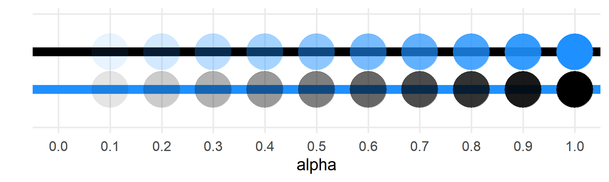
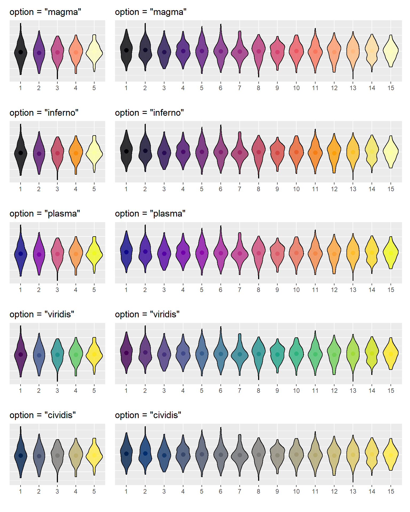
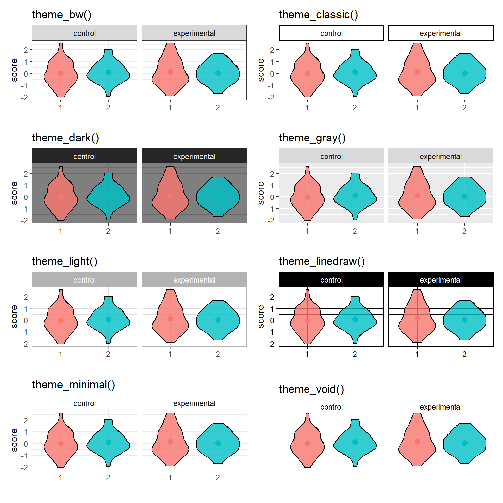
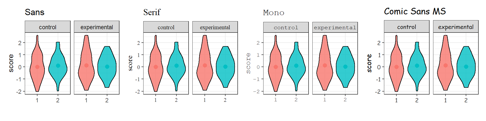
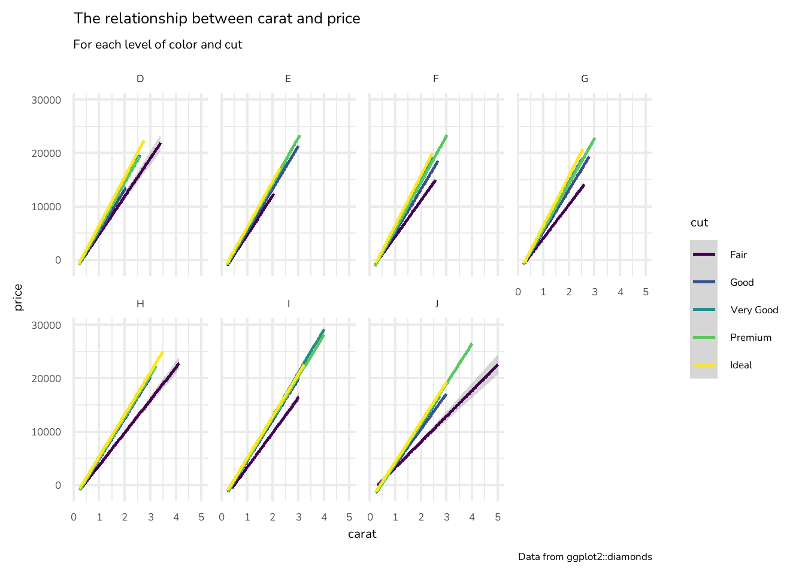
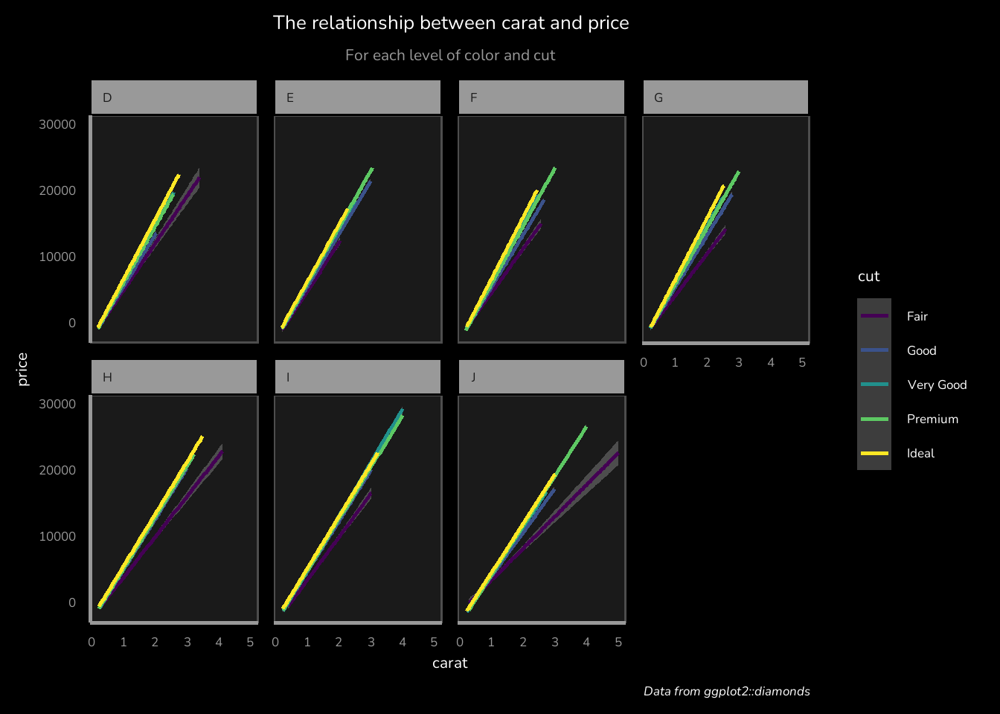

# Styling Plots {#plotstyle}


## Aesthetics

### Colour/Fill

The `colour` argument changes the point and line colour, while the `fill` argument changes the interior colour of shapes. Type `colours()` into the console to see a list of all the named colours in R. Alternatively, you can use hexadecimal colours like `"#FF8000"` or the `rgb()` function to set red, green, and blue values on a scale from 0 to 1.

Hover over a colour to see its R name.

<style>
  .colordemo { list-item-style: none; padding: 0; margin: 0;}
  
  .colordemo li, main ul.colordemo > li:first-child { 
    display: inline-block; 
    border: 0.25px solid black; 
    margin: 0px; 
    padding: 1.3em 0.2em 0.2em 1.2em; 
  }
  
  .colordemo li span { 
    display: none; 
    background-color: white; 
    border: 0.25px solid black; 
    padding: 0.25em 0.5em; 
    border-radius: 0 1em 1em 1em;
  }
  .colordemo li:hover span { 
    display: inline; 
    position: absolute;
  }
</style>


<ul class='colordemo'>
    <li style='background-color: #000000;'><span>black</span></li>
    <li style='background-color: #030303;'><span>gray1</span></li>
    <li style='background-color: #050505;'><span>gray2</span></li>
    <li style='background-color: #080808;'><span>gray3</span></li>
    <li style='background-color: #0a0a0a;'><span>gray4</span></li>
    <li style='background-color: #0d0d0d;'><span>gray5</span></li>
    <li style='background-color: #0f0f0f;'><span>gray6</span></li>
    <li style='background-color: #121212;'><span>gray7</span></li>
    <li style='background-color: #141414;'><span>gray8</span></li>
    <li style='background-color: #171717;'><span>gray9</span></li>
    <li style='background-color: #1a1a1a;'><span>gray10</span></li>
    <li style='background-color: #1c1c1c;'><span>gray11</span></li>
    <li style='background-color: #1f1f1f;'><span>gray12</span></li>
    <li style='background-color: #212121;'><span>gray13</span></li>
    <li style='background-color: #242424;'><span>gray14</span></li>
    <li style='background-color: #262626;'><span>gray15</span></li>
    <li style='background-color: #292929;'><span>gray16</span></li>
    <li style='background-color: #2b2b2b;'><span>gray17</span></li>
    <li style='background-color: #2e2e2e;'><span>gray18</span></li>
    <li style='background-color: #303030;'><span>gray19</span></li>
    <li style='background-color: #333333;'><span>gray20</span></li>
    <li style='background-color: #363636;'><span>gray21</span></li>
    <li style='background-color: #383838;'><span>gray22</span></li>
    <li style='background-color: #3b3b3b;'><span>gray23</span></li>
    <li style='background-color: #3d3d3d;'><span>gray24</span></li>
    <li style='background-color: #404040;'><span>gray25</span></li>
    <li style='background-color: #424242;'><span>gray26</span></li>
    <li style='background-color: #454545;'><span>gray27</span></li>
    <li style='background-color: #474747;'><span>gray28</span></li>
    <li style='background-color: #4a4a4a;'><span>gray29</span></li>
    <li style='background-color: #4d4d4d;'><span>gray30</span></li>
    <li style='background-color: #4f4f4f;'><span>gray31</span></li>
    <li style='background-color: #525252;'><span>gray32</span></li>
    <li style='background-color: #545454;'><span>gray33</span></li>
    <li style='background-color: #575757;'><span>gray34</span></li>
    <li style='background-color: #595959;'><span>gray35</span></li>
    <li style='background-color: #5c5c5c;'><span>gray36</span></li>
    <li style='background-color: #5e5e5e;'><span>gray37</span></li>
    <li style='background-color: #616161;'><span>gray38</span></li>
    <li style='background-color: #636363;'><span>gray39</span></li>
    <li style='background-color: #666666;'><span>gray40</span></li>
    <li style='background-color: #696969;'><span>dimgray</span></li>
    <li style='background-color: #6b6b6b;'><span>gray42</span></li>
    <li style='background-color: #6e6e6e;'><span>gray43</span></li>
    <li style='background-color: #707070;'><span>gray44</span></li>
    <li style='background-color: #737373;'><span>gray45</span></li>
    <li style='background-color: #757575;'><span>gray46</span></li>
    <li style='background-color: #787878;'><span>gray47</span></li>
    <li style='background-color: #7a7a7a;'><span>gray48</span></li>
    <li style='background-color: #7d7d7d;'><span>gray49</span></li>
    <li style='background-color: #7f7f7f;'><span>gray50</span></li>
    <li style='background-color: #828282;'><span>gray51</span></li>
    <li style='background-color: #858585;'><span>gray52</span></li>
    <li style='background-color: #878787;'><span>gray53</span></li>
    <li style='background-color: #8a8a8a;'><span>gray54</span></li>
    <li style='background-color: #8c8c8c;'><span>gray55</span></li>
    <li style='background-color: #8f8f8f;'><span>gray56</span></li>
    <li style='background-color: #919191;'><span>gray57</span></li>
    <li style='background-color: #949494;'><span>gray58</span></li>
    <li style='background-color: #969696;'><span>gray59</span></li>
    <li style='background-color: #999999;'><span>gray60</span></li>
    <li style='background-color: #9c9c9c;'><span>gray61</span></li>
    <li style='background-color: #9e9e9e;'><span>gray62</span></li>
    <li style='background-color: #a1a1a1;'><span>gray63</span></li>
    <li style='background-color: #a3a3a3;'><span>gray64</span></li>
    <li style='background-color: #a6a6a6;'><span>gray65</span></li>
    <li style='background-color: #a9a9a9;'><span>darkgray</span></li>
    <li style='background-color: #a8a8a8;'><span>gray66</span></li>
    <li style='background-color: #ababab;'><span>gray67</span></li>
    <li style='background-color: #adadad;'><span>gray68</span></li>
    <li style='background-color: #b0b0b0;'><span>gray69</span></li>
    <li style='background-color: #b3b3b3;'><span>gray70</span></li>
    <li style='background-color: #b5b5b5;'><span>gray71</span></li>
    <li style='background-color: #b8b8b8;'><span>gray72</span></li>
    <li style='background-color: #bababa;'><span>gray73</span></li>
    <li style='background-color: #bdbdbd;'><span>gray74</span></li>
    <li style='background-color: #bebebe;'><span>gray</span></li>
    <li style='background-color: #bfbfbf;'><span>gray75</span></li>
    <li style='background-color: #c2c2c2;'><span>gray76</span></li>
    <li style='background-color: #c4c4c4;'><span>gray77</span></li>
    <li style='background-color: #c7c7c7;'><span>gray78</span></li>
    <li style='background-color: #c9c9c9;'><span>gray79</span></li>
    <li style='background-color: #cccccc;'><span>gray80</span></li>
    <li style='background-color: #cfcfcf;'><span>gray81</span></li>
    <li style='background-color: #d1d1d1;'><span>gray82</span></li>
    <li style='background-color: #d4d4d4;'><span>gray83</span></li>
    <li style='background-color: #d3d3d3;'><span>lightgray</span></li>
    <li style='background-color: #d6d6d6;'><span>gray84</span></li>
    <li style='background-color: #d9d9d9;'><span>gray85</span></li>
    <li style='background-color: #dcdcdc;'><span>gainsboro</span></li>
    <li style='background-color: #dbdbdb;'><span>gray86</span></li>
    <li style='background-color: #dedede;'><span>gray87</span></li>
    <li style='background-color: #e0e0e0;'><span>gray88</span></li>
    <li style='background-color: #e3e3e3;'><span>gray89</span></li>
    <li style='background-color: #e5e5e5;'><span>gray90</span></li>
    <li style='background-color: #e8e8e8;'><span>gray91</span></li>
    <li style='background-color: #ebebeb;'><span>gray92</span></li>
    <li style='background-color: #ededed;'><span>gray93</span></li>
    <li style='background-color: #f0f0f0;'><span>gray94</span></li>
    <li style='background-color: #f2f2f2;'><span>gray95</span></li>
    <li style='background-color: #f5f5f5;'><span>gray96</span></li>
    <li style='background-color: #f7f7f7;'><span>gray97</span></li>
    <li style='background-color: #fafafa;'><span>gray98</span></li>
    <li style='background-color: #fcfcfc;'><span>gray99</span></li>
    <li style='background-color: #ffffff;'><span>white</span></li>
    <li style='background-color: #8b8989;'><span>snow4</span></li>
    <li style='background-color: #cdc9c9;'><span>snow3</span></li>
    <li style='background-color: #eee9e9;'><span>snow2</span></li>
    <li style='background-color: #fffafa;'><span>snow</span></li>
    <li style='background-color: #8b6969;'><span>rosybrown4</span></li>
    <li style='background-color: #bc8f8f;'><span>rosybrown</span></li>
    <li style='background-color: #cd9b9b;'><span>rosybrown3</span></li>
    <li style='background-color: #eeb4b4;'><span>rosybrown2</span></li>
    <li style='background-color: #ffc1c1;'><span>rosybrown1</span></li>
    <li style='background-color: #f08080;'><span>lightcoral</span></li>
    <li style='background-color: #cd5c5c;'><span>indianred</span></li>
    <li style='background-color: #8b3a3a;'><span>indianred4</span></li>
    <li style='background-color: #ee6363;'><span>indianred2</span></li>
    <li style='background-color: #ff6a6a;'><span>indianred1</span></li>
    <li style='background-color: #cd5555;'><span>indianred3</span></li>
    <li style='background-color: #8b2323;'><span>brown4</span></li>
    <li style='background-color: #a52a2a;'><span>brown</span></li>
    <li style='background-color: #cd3333;'><span>brown3</span></li>
    <li style='background-color: #ee3b3b;'><span>brown2</span></li>
    <li style='background-color: #ff4040;'><span>brown1</span></li>
    <li style='background-color: #8b1a1a;'><span>firebrick4</span></li>
    <li style='background-color: #b22222;'><span>firebrick</span></li>
    <li style='background-color: #cd2626;'><span>firebrick3</span></li>
    <li style='background-color: #ff3030;'><span>firebrick1</span></li>
    <li style='background-color: #ee2c2c;'><span>firebrick2</span></li>
    <li style='background-color: #8b0000;'><span>darkred</span></li>
    <li style='background-color: #cd0000;'><span>red3</span></li>
    <li style='background-color: #ee0000;'><span>red2</span></li>
    <li style='background-color: #ff0000;'><span>red</span></li>
    <li style='background-color: #cdb7b5;'><span>mistyrose3</span></li>
    <li style='background-color: #8b7d7b;'><span>mistyrose4</span></li>
    <li style='background-color: #eed5d2;'><span>mistyrose2</span></li>
    <li style='background-color: #ffe4e1;'><span>mistyrose</span></li>
    <li style='background-color: #fa8072;'><span>salmon</span></li>
    <li style='background-color: #cd4f39;'><span>tomato3</span></li>
    <li style='background-color: #8b3e2f;'><span>coral4</span></li>
    <li style='background-color: #cd5b45;'><span>coral3</span></li>
    <li style='background-color: #ee6a50;'><span>coral2</span></li>
    <li style='background-color: #ff7256;'><span>coral1</span></li>
    <li style='background-color: #ee5c42;'><span>tomato2</span></li>
    <li style='background-color: #ff6347;'><span>tomato</span></li>
    <li style='background-color: #8b3626;'><span>tomato4</span></li>
    <li style='background-color: #e9967a;'><span>darksalmon</span></li>
    <li style='background-color: #8b4c39;'><span>salmon4</span></li>
    <li style='background-color: #cd7054;'><span>salmon3</span></li>
    <li style='background-color: #ee8262;'><span>salmon2</span></li>
    <li style='background-color: #ff8c69;'><span>salmon1</span></li>
    <li style='background-color: #ff7f50;'><span>coral</span></li>
    <li style='background-color: #8b2500;'><span>orangered4</span></li>
    <li style='background-color: #cd3700;'><span>orangered3</span></li>
    <li style='background-color: #ee4000;'><span>orangered2</span></li>
    <li style='background-color: #cd8162;'><span>lightsalmon3</span></li>
    <li style='background-color: #ee9572;'><span>lightsalmon2</span></li>
    <li style='background-color: #ffa07a;'><span>lightsalmon</span></li>
    <li style='background-color: #8b5742;'><span>lightsalmon4</span></li>
    <li style='background-color: #a0522d;'><span>sienna</span></li>
    <li style='background-color: #cd6839;'><span>sienna3</span></li>
    <li style='background-color: #ee7942;'><span>sienna2</span></li>
    <li style='background-color: #ff8247;'><span>sienna1</span></li>
    <li style='background-color: #8b4726;'><span>sienna4</span></li>
    <li style='background-color: #ff4500;'><span>orangered</span></li>
    <li style='background-color: #8b8682;'><span>seashell4</span></li>
    <li style='background-color: #cdc5bf;'><span>seashell3</span></li>
    <li style='background-color: #eee5de;'><span>seashell2</span></li>
    <li style='background-color: #fff5ee;'><span>seashell</span></li>
    <li style='background-color: #8b4513;'><span>chocolate4</span></li>
    <li style='background-color: #cd661d;'><span>chocolate3</span></li>
    <li style='background-color: #d2691e;'><span>chocolate</span></li>
    <li style='background-color: #ee7621;'><span>chocolate2</span></li>
    <li style='background-color: #ff7f24;'><span>chocolate1</span></li>
    <li style='background-color: #faf0e6;'><span>linen</span></li>
    <li style='background-color: #8b7765;'><span>peachpuff4</span></li>
    <li style='background-color: #cdaf95;'><span>peachpuff3</span></li>
    <li style='background-color: #eecbad;'><span>peachpuff2</span></li>
    <li style='background-color: #ffdab9;'><span>peachpuff</span></li>
    <li style='background-color: #f4a460;'><span>sandybrown</span></li>
    <li style='background-color: #8b5a2b;'><span>tan4</span></li>
    <li style='background-color: #cd853f;'><span>peru</span></li>
    <li style='background-color: #ee9a49;'><span>tan2</span></li>
    <li style='background-color: #ffa54f;'><span>tan1</span></li>
    <li style='background-color: #8b4500;'><span>darkorange4</span></li>
    <li style='background-color: #cd6600;'><span>darkorange3</span></li>
    <li style='background-color: #ee7600;'><span>darkorange2</span></li>
    <li style='background-color: #ff7f00;'><span>darkorange1</span></li>
    <li style='background-color: #cdc0b0;'><span>antiquewhite3</span></li>
    <li style='background-color: #eedfcc;'><span>antiquewhite2</span></li>
    <li style='background-color: #ffefdb;'><span>antiquewhite1</span></li>
    <li style='background-color: #8b7d6b;'><span>bisque4</span></li>
    <li style='background-color: #cdb79e;'><span>bisque3</span></li>
    <li style='background-color: #eed5b7;'><span>bisque2</span></li>
    <li style='background-color: #ffe4c4;'><span>bisque</span></li>
    <li style='background-color: #8b7355;'><span>burlywood4</span></li>
    <li style='background-color: #cdaa7d;'><span>burlywood3</span></li>
    <li style='background-color: #deb887;'><span>burlywood</span></li>
    <li style='background-color: #eec591;'><span>burlywood2</span></li>
    <li style='background-color: #ffd39b;'><span>burlywood1</span></li>
    <li style='background-color: #ff8c00;'><span>darkorange</span></li>
    <li style='background-color: #8b8378;'><span>antiquewhite4</span></li>
    <li style='background-color: #faebd7;'><span>antiquewhite</span></li>
    <li style='background-color: #ffefd5;'><span>papayawhip</span></li>
    <li style='background-color: #ffebcd;'><span>blanchedalmond</span></li>
    <li style='background-color: #8b795e;'><span>navajowhite4</span></li>
    <li style='background-color: #cdb38b;'><span>navajowhite3</span></li>
    <li style='background-color: #eecfa1;'><span>navajowhite2</span></li>
    <li style='background-color: #ffdead;'><span>navajowhite</span></li>
    <li style='background-color: #d2b48c;'><span>tan</span></li>
    <li style='background-color: #fffaf0;'><span>floralwhite</span></li>
    <li style='background-color: #fdf5e6;'><span>oldlace</span></li>
    <li style='background-color: #8b7e66;'><span>wheat4</span></li>
    <li style='background-color: #cdba96;'><span>wheat3</span></li>
    <li style='background-color: #eed8ae;'><span>wheat2</span></li>
    <li style='background-color: #f5deb3;'><span>wheat</span></li>
    <li style='background-color: #ffe7ba;'><span>wheat1</span></li>
    <li style='background-color: #ffe4b5;'><span>moccasin</span></li>
    <li style='background-color: #8b5a00;'><span>orange4</span></li>
    <li style='background-color: #cd8500;'><span>orange3</span></li>
    <li style='background-color: #ee9a00;'><span>orange2</span></li>
    <li style='background-color: #ffa500;'><span>orange</span></li>
    <li style='background-color: #daa520;'><span>goldenrod</span></li>
    <li style='background-color: #ffc125;'><span>goldenrod1</span></li>
    <li style='background-color: #8b6914;'><span>goldenrod4</span></li>
    <li style='background-color: #cd9b1d;'><span>goldenrod3</span></li>
    <li style='background-color: #eeb422;'><span>goldenrod2</span></li>
    <li style='background-color: #8b6508;'><span>darkgoldenrod4</span></li>
    <li style='background-color: #b8860b;'><span>darkgoldenrod</span></li>
    <li style='background-color: #cd950c;'><span>darkgoldenrod3</span></li>
    <li style='background-color: #eead0e;'><span>darkgoldenrod2</span></li>
    <li style='background-color: #ffb90f;'><span>darkgoldenrod1</span></li>
    <li style='background-color: #fff8dc;'><span>cornsilk</span></li>
    <li style='background-color: #8b8878;'><span>cornsilk4</span></li>
    <li style='background-color: #cdc8b1;'><span>cornsilk3</span></li>
    <li style='background-color: #eee8cd;'><span>cornsilk2</span></li>
    <li style='background-color: #8b814c;'><span>lightgoldenrod4</span></li>
    <li style='background-color: #cdbe70;'><span>lightgoldenrod3</span></li>
    <li style='background-color: #eedd82;'><span>lightgoldenrod</span></li>
    <li style='background-color: #eedc82;'><span>lightgoldenrod2</span></li>
    <li style='background-color: #ffec8b;'><span>lightgoldenrod1</span></li>
    <li style='background-color: #8b7500;'><span>gold4</span></li>
    <li style='background-color: #cdad00;'><span>gold3</span></li>
    <li style='background-color: #eec900;'><span>gold2</span></li>
    <li style='background-color: #ffd700;'><span>gold</span></li>
    <li style='background-color: #8b8970;'><span>lemonchiffon4</span></li>
    <li style='background-color: #cdc9a5;'><span>lemonchiffon3</span></li>
    <li style='background-color: #eee9bf;'><span>lemonchiffon2</span></li>
    <li style='background-color: #fffacd;'><span>lemonchiffon</span></li>
    <li style='background-color: #eee8aa;'><span>palegoldenrod</span></li>
    <li style='background-color: #f0e68c;'><span>khaki</span></li>
    <li style='background-color: #bdb76b;'><span>darkkhaki</span></li>
    <li style='background-color: #8b864e;'><span>khaki4</span></li>
    <li style='background-color: #cdc673;'><span>khaki3</span></li>
    <li style='background-color: #eee685;'><span>khaki2</span></li>
    <li style='background-color: #fff68f;'><span>khaki1</span></li>
    <li style='background-color: #8b8b83;'><span>ivory4</span></li>
    <li style='background-color: #cdcdc1;'><span>ivory3</span></li>
    <li style='background-color: #eeeee0;'><span>ivory2</span></li>
    <li style='background-color: #fffff0;'><span>ivory</span></li>
    <li style='background-color: #f5f5dc;'><span>beige</span></li>
    <li style='background-color: #8b8b7a;'><span>lightyellow4</span></li>
    <li style='background-color: #cdcdb4;'><span>lightyellow3</span></li>
    <li style='background-color: #eeeed1;'><span>lightyellow2</span></li>
    <li style='background-color: #ffffe0;'><span>lightyellow</span></li>
    <li style='background-color: #fafad2;'><span>lightgoldenrodyellow</span></li>
    <li style='background-color: #8b8b00;'><span>yellow4</span></li>
    <li style='background-color: #cdcd00;'><span>yellow3</span></li>
    <li style='background-color: #eeee00;'><span>yellow2</span></li>
    <li style='background-color: #ffff00;'><span>yellow</span></li>
    <li style='background-color: #6b8e23;'><span>olivedrab</span></li>
    <li style='background-color: #698b22;'><span>olivedrab4</span></li>
    <li style='background-color: #9acd32;'><span>olivedrab3</span></li>
    <li style='background-color: #b3ee3a;'><span>olivedrab2</span></li>
    <li style='background-color: #c0ff3e;'><span>olivedrab1</span></li>
    <li style='background-color: #556b2f;'><span>darkolivegreen</span></li>
    <li style='background-color: #6e8b3d;'><span>darkolivegreen4</span></li>
    <li style='background-color: #a2cd5a;'><span>darkolivegreen3</span></li>
    <li style='background-color: #bcee68;'><span>darkolivegreen2</span></li>
    <li style='background-color: #caff70;'><span>darkolivegreen1</span></li>
    <li style='background-color: #adff2f;'><span>greenyellow</span></li>
    <li style='background-color: #458b00;'><span>chartreuse4</span></li>
    <li style='background-color: #66cd00;'><span>chartreuse3</span></li>
    <li style='background-color: #76ee00;'><span>chartreuse2</span></li>
    <li style='background-color: #7cfc00;'><span>lawngreen</span></li>
    <li style='background-color: #7fff00;'><span>chartreuse</span></li>
    <li style='background-color: #838b83;'><span>honeydew4</span></li>
    <li style='background-color: #c1cdc1;'><span>honeydew3</span></li>
    <li style='background-color: #e0eee0;'><span>honeydew2</span></li>
    <li style='background-color: #f0fff0;'><span>honeydew</span></li>
    <li style='background-color: #698b69;'><span>darkseagreen4</span></li>
    <li style='background-color: #8fbc8f;'><span>darkseagreen</span></li>
    <li style='background-color: #9bcd9b;'><span>darkseagreen3</span></li>
    <li style='background-color: #b4eeb4;'><span>darkseagreen2</span></li>
    <li style='background-color: #c1ffc1;'><span>darkseagreen1</span></li>
    <li style='background-color: #90ee90;'><span>lightgreen</span></li>
    <li style='background-color: #98fb98;'><span>palegreen</span></li>
    <li style='background-color: #548b54;'><span>palegreen4</span></li>
    <li style='background-color: #7ccd7c;'><span>palegreen3</span></li>
    <li style='background-color: #9aff9a;'><span>palegreen1</span></li>
    <li style='background-color: #228b22;'><span>forestgreen</span></li>
    <li style='background-color: #32cd32;'><span>limegreen</span></li>
    <li style='background-color: #006400;'><span>darkgreen</span></li>
    <li style='background-color: #008b00;'><span>green4</span></li>
    <li style='background-color: #00cd00;'><span>green3</span></li>
    <li style='background-color: #00ee00;'><span>green2</span></li>
    <li style='background-color: #00ff00;'><span>green</span></li>
    <li style='background-color: #3cb371;'><span>mediumseagreen</span></li>
    <li style='background-color: #2e8b57;'><span>seagreen</span></li>
    <li style='background-color: #43cd80;'><span>seagreen3</span></li>
    <li style='background-color: #4eee94;'><span>seagreen2</span></li>
    <li style='background-color: #54ff9f;'><span>seagreen1</span></li>
    <li style='background-color: #f5fffa;'><span>mintcream</span></li>
    <li style='background-color: #008b45;'><span>springgreen4</span></li>
    <li style='background-color: #00cd66;'><span>springgreen3</span></li>
    <li style='background-color: #00ee76;'><span>springgreen2</span></li>
    <li style='background-color: #00ff7f;'><span>springgreen</span></li>
    <li style='background-color: #66cdaa;'><span>aquamarine3</span></li>
    <li style='background-color: #76eec6;'><span>aquamarine2</span></li>
    <li style='background-color: #7fffd4;'><span>aquamarine</span></li>
    <li style='background-color: #00fa9a;'><span>mediumspringgreen</span></li>
    <li style='background-color: #458b74;'><span>aquamarine4</span></li>
    <li style='background-color: #40e0d0;'><span>turquoise</span></li>
    <li style='background-color: #48d1cc;'><span>mediumturquoise</span></li>
    <li style='background-color: #20b2aa;'><span>lightseagreen</span></li>
    <li style='background-color: #838b8b;'><span>azure4</span></li>
    <li style='background-color: #c1cdcd;'><span>azure3</span></li>
    <li style='background-color: #e0eeee;'><span>azure2</span></li>
    <li style='background-color: #f0ffff;'><span>azure</span></li>
    <li style='background-color: #7a8b8b;'><span>lightcyan4</span></li>
    <li style='background-color: #b4cdcd;'><span>lightcyan3</span></li>
    <li style='background-color: #d1eeee;'><span>lightcyan2</span></li>
    <li style='background-color: #e0ffff;'><span>lightcyan</span></li>
    <li style='background-color: #afeeee;'><span>paleturquoise</span></li>
    <li style='background-color: #668b8b;'><span>paleturquoise4</span></li>
    <li style='background-color: #96cdcd;'><span>paleturquoise3</span></li>
    <li style='background-color: #aeeeee;'><span>paleturquoise2</span></li>
    <li style='background-color: #bbffff;'><span>paleturquoise1</span></li>
    <li style='background-color: #2f4f4f;'><span>darkslategray</span></li>
    <li style='background-color: #528b8b;'><span>darkslategray4</span></li>
    <li style='background-color: #79cdcd;'><span>darkslategray3</span></li>
    <li style='background-color: #8deeee;'><span>darkslategray2</span></li>
    <li style='background-color: #97ffff;'><span>darkslategray1</span></li>
    <li style='background-color: #008b8b;'><span>cyan4</span></li>
    <li style='background-color: #00cdcd;'><span>cyan3</span></li>
    <li style='background-color: #00ced1;'><span>darkturquoise</span></li>
    <li style='background-color: #00eeee;'><span>cyan2</span></li>
    <li style='background-color: #00ffff;'><span>cyan</span></li>
    <li style='background-color: #53868b;'><span>cadetblue4</span></li>
    <li style='background-color: #5f9ea0;'><span>cadetblue</span></li>
    <li style='background-color: #00868b;'><span>turquoise4</span></li>
    <li style='background-color: #00c5cd;'><span>turquoise3</span></li>
    <li style='background-color: #00e5ee;'><span>turquoise2</span></li>
    <li style='background-color: #00f5ff;'><span>turquoise1</span></li>
    <li style='background-color: #b0e0e6;'><span>powderblue</span></li>
    <li style='background-color: #7ac5cd;'><span>cadetblue3</span></li>
    <li style='background-color: #8ee5ee;'><span>cadetblue2</span></li>
    <li style='background-color: #98f5ff;'><span>cadetblue1</span></li>
    <li style='background-color: #68838b;'><span>lightblue4</span></li>
    <li style='background-color: #9ac0cd;'><span>lightblue3</span></li>
    <li style='background-color: #add8e6;'><span>lightblue</span></li>
    <li style='background-color: #b2dfee;'><span>lightblue2</span></li>
    <li style='background-color: #bfefff;'><span>lightblue1</span></li>
    <li style='background-color: #00688b;'><span>deepskyblue4</span></li>
    <li style='background-color: #009acd;'><span>deepskyblue3</span></li>
    <li style='background-color: #00b2ee;'><span>deepskyblue2</span></li>
    <li style='background-color: #00bfff;'><span>deepskyblue</span></li>
    <li style='background-color: #87ceeb;'><span>skyblue</span></li>
    <li style='background-color: #607b8b;'><span>lightskyblue4</span></li>
    <li style='background-color: #8db6cd;'><span>lightskyblue3</span></li>
    <li style='background-color: #a4d3ee;'><span>lightskyblue2</span></li>
    <li style='background-color: #b0e2ff;'><span>lightskyblue1</span></li>
    <li style='background-color: #87cefa;'><span>lightskyblue</span></li>
    <li style='background-color: #4a708b;'><span>skyblue4</span></li>
    <li style='background-color: #6ca6cd;'><span>skyblue3</span></li>
    <li style='background-color: #7ec0ee;'><span>skyblue2</span></li>
    <li style='background-color: #87ceff;'><span>skyblue1</span></li>
    <li style='background-color: #f0f8ff;'><span>aliceblue</span></li>
    <li style='background-color: #708090;'><span>slategray</span></li>
    <li style='background-color: #778899;'><span>lightslategray</span></li>
    <li style='background-color: #9fb6cd;'><span>slategray3</span></li>
    <li style='background-color: #b9d3ee;'><span>slategray2</span></li>
    <li style='background-color: #c6e2ff;'><span>slategray1</span></li>
    <li style='background-color: #36648b;'><span>steelblue4</span></li>
    <li style='background-color: #4682b4;'><span>steelblue</span></li>
    <li style='background-color: #4f94cd;'><span>steelblue3</span></li>
    <li style='background-color: #5cacee;'><span>steelblue2</span></li>
    <li style='background-color: #63b8ff;'><span>steelblue1</span></li>
    <li style='background-color: #104e8b;'><span>dodgerblue4</span></li>
    <li style='background-color: #1874cd;'><span>dodgerblue3</span></li>
    <li style='background-color: #1c86ee;'><span>dodgerblue2</span></li>
    <li style='background-color: #1e90ff;'><span>dodgerblue</span></li>
    <li style='background-color: #6e7b8b;'><span>lightsteelblue4</span></li>
    <li style='background-color: #a2b5cd;'><span>lightsteelblue3</span></li>
    <li style='background-color: #b0c4de;'><span>lightsteelblue</span></li>
    <li style='background-color: #bcd2ee;'><span>lightsteelblue2</span></li>
    <li style='background-color: #cae1ff;'><span>lightsteelblue1</span></li>
    <li style='background-color: #6c7b8b;'><span>slategray4</span></li>
    <li style='background-color: #6495ed;'><span>cornflowerblue</span></li>
    <li style='background-color: #4169e1;'><span>royalblue</span></li>
    <li style='background-color: #27408b;'><span>royalblue4</span></li>
    <li style='background-color: #3a5fcd;'><span>royalblue3</span></li>
    <li style='background-color: #436eee;'><span>royalblue2</span></li>
    <li style='background-color: #4876ff;'><span>royalblue1</span></li>
    <li style='background-color: #f8f8ff;'><span>ghostwhite</span></li>
    <li style='background-color: #e6e6fa;'><span>lavender</span></li>
    <li style='background-color: #191970;'><span>midnightblue</span></li>
    <li style='background-color: #000080;'><span>navy</span></li>
    <li style='background-color: #00008b;'><span>blue4</span></li>
    <li style='background-color: #0000cd;'><span>blue3</span></li>
    <li style='background-color: #0000ee;'><span>blue2</span></li>
    <li style='background-color: #0000ff;'><span>blue</span></li>
    <li style='background-color: #483d8b;'><span>darkslateblue</span></li>
    <li style='background-color: #6a5acd;'><span>slateblue</span></li>
    <li style='background-color: #7b68ee;'><span>mediumslateblue</span></li>
    <li style='background-color: #8470ff;'><span>lightslateblue</span></li>
    <li style='background-color: #836fff;'><span>slateblue1</span></li>
    <li style='background-color: #473c8b;'><span>slateblue4</span></li>
    <li style='background-color: #6959cd;'><span>slateblue3</span></li>
    <li style='background-color: #7a67ee;'><span>slateblue2</span></li>
    <li style='background-color: #5d478b;'><span>mediumpurple4</span></li>
    <li style='background-color: #8968cd;'><span>mediumpurple3</span></li>
    <li style='background-color: #9370db;'><span>mediumpurple</span></li>
    <li style='background-color: #9f79ee;'><span>mediumpurple2</span></li>
    <li style='background-color: #ab82ff;'><span>mediumpurple1</span></li>
    <li style='background-color: #551a8b;'><span>purple4</span></li>
    <li style='background-color: #7d26cd;'><span>purple3</span></li>
    <li style='background-color: #8a2be2;'><span>blueviolet</span></li>
    <li style='background-color: #9b30ff;'><span>purple1</span></li>
    <li style='background-color: #912cee;'><span>purple2</span></li>
    <li style='background-color: #a020f0;'><span>purple</span></li>
    <li style='background-color: #9932cc;'><span>darkorchid</span></li>
    <li style='background-color: #68228b;'><span>darkorchid4</span></li>
    <li style='background-color: #9a32cd;'><span>darkorchid3</span></li>
    <li style='background-color: #b23aee;'><span>darkorchid2</span></li>
    <li style='background-color: #bf3eff;'><span>darkorchid1</span></li>
    <li style='background-color: #9400d3;'><span>darkviolet</span></li>
    <li style='background-color: #7a378b;'><span>mediumorchid4</span></li>
    <li style='background-color: #b452cd;'><span>mediumorchid3</span></li>
    <li style='background-color: #ba55d3;'><span>mediumorchid</span></li>
    <li style='background-color: #d15fee;'><span>mediumorchid2</span></li>
    <li style='background-color: #e066ff;'><span>mediumorchid1</span></li>
    <li style='background-color: #8b7b8b;'><span>thistle4</span></li>
    <li style='background-color: #cdb5cd;'><span>thistle3</span></li>
    <li style='background-color: #d8bfd8;'><span>thistle</span></li>
    <li style='background-color: #eed2ee;'><span>thistle2</span></li>
    <li style='background-color: #ffe1ff;'><span>thistle1</span></li>
    <li style='background-color: #8b668b;'><span>plum4</span></li>
    <li style='background-color: #cd96cd;'><span>plum3</span></li>
    <li style='background-color: #eeaeee;'><span>plum2</span></li>
    <li style='background-color: #ffbbff;'><span>plum1</span></li>
    <li style='background-color: #dda0dd;'><span>plum</span></li>
    <li style='background-color: #ee82ee;'><span>violet</span></li>
    <li style='background-color: #8b008b;'><span>darkmagenta</span></li>
    <li style='background-color: #cd00cd;'><span>magenta3</span></li>
    <li style='background-color: #ee00ee;'><span>magenta2</span></li>
    <li style='background-color: #ff00ff;'><span>magenta</span></li>
    <li style='background-color: #8b4789;'><span>orchid4</span></li>
    <li style='background-color: #cd69c9;'><span>orchid3</span></li>
    <li style='background-color: #da70d6;'><span>orchid</span></li>
    <li style='background-color: #ee7ae9;'><span>orchid2</span></li>
    <li style='background-color: #ff83fa;'><span>orchid1</span></li>
    <li style='background-color: #8b1c62;'><span>maroon4</span></li>
    <li style='background-color: #d02090;'><span>violetred</span></li>
    <li style='background-color: #cd2990;'><span>maroon3</span></li>
    <li style='background-color: #ee30a7;'><span>maroon2</span></li>
    <li style='background-color: #ff34b3;'><span>maroon1</span></li>
    <li style='background-color: #c71585;'><span>mediumvioletred</span></li>
    <li style='background-color: #cd1076;'><span>deeppink3</span></li>
    <li style='background-color: #ee1289;'><span>deeppink2</span></li>
    <li style='background-color: #ff1493;'><span>deeppink</span></li>
    <li style='background-color: #8b0a50;'><span>deeppink4</span></li>
    <li style='background-color: #ee6aa7;'><span>hotpink2</span></li>
    <li style='background-color: #ff6eb4;'><span>hotpink1</span></li>
    <li style='background-color: #8b3a62;'><span>hotpink4</span></li>
    <li style='background-color: #ff69b4;'><span>hotpink</span></li>
    <li style='background-color: #8b2252;'><span>violetred4</span></li>
    <li style='background-color: #cd3278;'><span>violetred3</span></li>
    <li style='background-color: #ee3a8c;'><span>violetred2</span></li>
    <li style='background-color: #ff3e96;'><span>violetred1</span></li>
    <li style='background-color: #cd6090;'><span>hotpink3</span></li>
    <li style='background-color: #8b8386;'><span>lavenderblush4</span></li>
    <li style='background-color: #cdc1c5;'><span>lavenderblush3</span></li>
    <li style='background-color: #eee0e5;'><span>lavenderblush2</span></li>
    <li style='background-color: #fff0f5;'><span>lavenderblush</span></li>
    <li style='background-color: #b03060;'><span>maroon</span></li>
    <li style='background-color: #8b475d;'><span>palevioletred4</span></li>
    <li style='background-color: #cd6889;'><span>palevioletred3</span></li>
    <li style='background-color: #db7093;'><span>palevioletred</span></li>
    <li style='background-color: #ee799f;'><span>palevioletred2</span></li>
    <li style='background-color: #ff82ab;'><span>palevioletred1</span></li>
    <li style='background-color: #8b636c;'><span>pink4</span></li>
    <li style='background-color: #cd919e;'><span>pink3</span></li>
    <li style='background-color: #eea9b8;'><span>pink2</span></li>
    <li style='background-color: #ffb5c5;'><span>pink1</span></li>
    <li style='background-color: #ffc0cb;'><span>pink</span></li>
    <li style='background-color: #ffb6c1;'><span>lightpink</span></li>
    <li style='background-color: #8b5f65;'><span>lightpink4</span></li>
    <li style='background-color: #cd8c95;'><span>lightpink3</span></li>
    <li style='background-color: #eea2ad;'><span>lightpink2</span></li>
    <li style='background-color: #ffaeb9;'><span>lightpink1</span></li>
</ul>

### Alpha

The `alpha` argument changes transparency (0 = totally transparent, 1 = totally opaque). 

<div class="figure" style="text-align: center">

<p class="caption">(\#fig:alpha-demo)Varying alpha values.</p>
</div>

### Shape

The `shape` argument changes the shape of points. 

<div class="figure" style="text-align: center">

<p class="caption">(\#fig:shape-demo)The 25 shape values</p>
</div>

### Linetype

You can probably guess what the `linetype` argument does.


<div class="figure" style="text-align: center">

<p class="caption">(\#fig:linetype-demo)The 6 linetype values at different sizes.</p>
</div>

## Palettes


Discrete palettes change depending on the number of categories. 

<div class="figure" style="text-align: center">

<p class="caption">(\#fig:unnamed-chunk-3)Default discrete palette with different numbers of levels.</p>
</div>


### Viridis Palettes

Viridis palettes are very good for colourblind-safe and greyscale-safe plots. The work with any number of categories, but are best for larger numbers of categories or continuous colours.

#### Discrete Viridis Palettes

Set <a class='glossary' target='_blank' title='Data that can only take certain values, such as integers.' href='https://psyteachr.github.io/glossary/d#discrete'>discrete</a> viridis colours with `scale_colour_viridis_d()` or `scale_fill_viridis_d()` and set the `option` argument to one of the options below. Set `direction = -1` to reverse the order of colours.


<div class="figure" style="text-align: center">

<p class="caption">(\#fig:unnamed-chunk-4)Discrete viridis palettes.</p>
</div>


::: {.info data-latex=""}
If the end colour is too light for your plot or the start colour too dark, you can set the `begin` and `end` arguments to values between 0 and 1, such as <code><span class='fu'>scale_colour_viridis_c</span><span class='op'>(</span>begin <span class='op'>=</span> <span class='fl'>0.1</span>, end <span class='op'>=</span> <span class='fl'>0.9</span><span class='op'>)</span></code>.
:::

#### Continuous Viridis Palettes

Set <a class='glossary' target='_blank' title='Data that can take on any values between other existing values.' href='https://psyteachr.github.io/glossary/c#continuous'>continuous</a> viridis colours with `scale_colour_viridis_c()` or `scale_fill_viridis_c()` and set the `option` argument to one of the options below. Set `direction = -1` to reverse the order of colours.

<div class="figure" style="text-align: center">

<p class="caption">(\#fig:unnamed-chunk-5)Continuous viridis palettes.</p>
</div>

### Brewer Palettes

Brewer palettes give you a lot of control over plot colour and fill. You set them with `scale_color_brewer()` or `scale_fill_brewer()` and set the `palette` argument to one of the palettes below. Set `direction = -1` to reverse the order of colours.

#### Qualitative Brewer Palettes

These palettes are good for <a class='glossary' target='_blank' title='Data that can only take certain values, such as types of pet.' href='https://psyteachr.github.io/glossary/c#categorical'>categorical</a> data with up to 8 categories (some palettes can handle up to 12). The "Paired" palette is useful if your categories are arranged in pairs.

<div class="figure" style="text-align: center">

<p class="caption">(\#fig:unnamed-chunk-6)Qualitative brewer palettes.</p>
</div>

#### Sequential Brewer Palettes

These palettes are good for up to 9 <a class='glossary' target='_blank' title='Discrete variables that have an inherent order, such as number of legs' href='https://psyteachr.github.io/glossary/o#ordinal'>ordinal</a> categories with a lot of categories.

<div class="figure" style="text-align: center">

<p class="caption">(\#fig:unnamed-chunk-7)Sequential brewer palettes.</p>
</div>

#### Diverging Brewer Palettes

These palettes are good for <a class='glossary' target='_blank' title='Discrete variables that have an inherent order, such as number of legs' href='https://psyteachr.github.io/glossary/o#ordinal'>ordinal</a> categories with up to 11 levels where the centre level is a neutral or baseline category and the levels above and below it differ in an important way, such as agree versus disagree options.

<div class="figure" style="text-align: center">

<p class="caption">(\#fig:unnamed-chunk-8)Diverging brewer palettes.</p>
</div>

## Themes {#themes-appendix}

<code class='package'>ggplot2</code> has 8 built-in themes that you can add to a plot like `plot + theme_bw()` or set as the default theme at the top of your script like `theme_set(theme_bw())`.

<div class="figure" style="text-align: center">

<p class="caption">(\#fig:unnamed-chunk-9){ggplot2} themes.</p>
</div>

### ggthemes

You can get more themes from add-on packages, like <code class='package'><a href='https://yutannihilation.github.io/allYourFigureAreBelongToUs/ggthemes/' target='_blank'>ggthemes</a></code>. Most of the themes also have custom `scale_` functions like `scale_colour_economist()`. Their website has extensive examples and instructions for alternate or dark versions of these themes.

<div class="figure" style="text-align: center">

<p class="caption">(\#fig:unnamed-chunk-10){ggthemes} themes.</p>
</div>


### Fonts

You can customise the fonts used in themes. All computers should be able to recognise the families "sans", "serif", and "mono", and some computers will be able to access other installed fonts by name.


```r
sans <- g + theme_bw(base_family = "sans") + 
  ggtitle("Sans")
serif <- g + theme_bw(base_family = "serif") + 
  ggtitle("Serif")
mono <- g + theme_bw(base_family = "mono") + 
  ggtitle("Mono")
font <- g + theme_bw(base_family = "Comic Sans MS") + 
  ggtitle("Comic Sans MS")

sans + serif + mono + font + plot_layout(nrow = 1)
```

<div class="figure" style="text-align: center">

<p class="caption">(\#fig:theme-font-demo)Different fonts.</p>
</div>


::: {.warning data-latex=""}
If you are working on a Windows machine and get the error "font family not found in Windows font database", you may need to explicitly map the fonts. In your setup code chunk, add the following code, which should fix the error. You may need to do this for any fonts that you specify.


:::


The <code class='package'>showtext</code> package is a flexible way to add fonts.

If you have a .ttf file from a font site, like [Font Squirrel](https://www.fontsquirrel.com){target="_blank"}, you can load the file directly using `font_add()`. Set `regular` as the path to the file for the regular version of the font, and optionally add other versions. Set the `family` to the name you want to use for the font. You will need to include any local font files if you are sharing your script with others.


```r
library(showtext)

# font from https://www.fontsquirrel.com/fonts/SF-Cartoonist-Hand

font_add(
  regular = "fonts/cartoonist/SF_Cartoonist_Hand.ttf",
  bold = "fonts/cartoonist/SF_Cartoonist_Hand_Bold.ttf",
  italic = "fonts/cartoonist/SF_Cartoonist_Hand_Italic.ttf",
  bolditalic = "fonts/cartoonist/SF_Cartoonist_Hand_Bold_Italic.ttf",
  family = "cartoonist" 
)
```

To download fonts directly from [Google fonts](https://fonts.google.com/){target="_blank"}, use the function `font_add_google()`, set the `name` to the exact name from the site, and the `family` to the name you want to use for the font.


```r
# download fonts from Google
font_add_google(name = "Courgette", family = "courgette")
font_add_google(name = "Poiret One", family = "poiret")
```

After you've added fonts from local files or Google, you need to make them available to R using `showtext_auto()`. You will have to do these steps in each script where you want to use the custom fonts.


```r
showtext_auto() # load the fonts
```

To change the fonts used overall in a plot, use the `theme()` function and set `text` to `element_text(family = "new_font_family")`.


```r
a <- g + theme(text = element_text(family = "courgette")) +
  ggtitle("Courgette")
b <- g + theme(text = element_text(family = "cartoonist")) +
  ggtitle("Cartoonist Hand")
c <- g + theme(text = element_text(family = "poiret")) +
  ggtitle("Poiret One")

a + b + c
```

<div class="figure" style="text-align: center">

<p class="caption">(\#fig:font-demo)Custom Fonts.</p>
</div>

To set the fonts for individual elements in the plot, you need to find the specific argument for that element. You can use the argument `face` to choose "bold", "italic",  or "bolditalic" versions, if they are available.


```r
g + ggtitle("Cartoonist Hand") +
  theme(
    title = element_text(family = "cartoonist", face = "bold"),
    strip.text = element_text(family = "cartoonist", face = "italic"),
    axis.text = element_text(family = "sans")
  )
```

<div class="figure" style="text-align: center">

<p class="caption">(\#fig:demo-multi-text)Multiple custom fonts on the same plot.</p>
</div>

### Setting A Lab Theme using `theme()`

The `theme()` function, as we mentioned, does a lot more than just change the position of a legend and can be used to really control a variety of elements and to eventually create your own "theme" for your figures - say you want to have a consistent look to your figures across your publications or across your lab posters. 

First, we'll create a basic plot to demonstrate the changes.


```r
g <- ggplot(diamonds, aes(x = carat, 
                          y = price, 
                          color = cut)) +
  facet_wrap(~color, nrow = 2) +
  geom_smooth(method = lm, formula = y~x) +
  labs(title = "The relationship between carat and price",
       subtitle = "For each level of color and cut",
       caption = "Data from ggplot2::diamonds")

g
```

<div class="figure" style="text-align: center">

<p class="caption">(\#fig:theme-plot)Basic plot in default theme</p>
</div>


Always start with a base theme, like `theme_minimal()` and set the size and font. Make sure to load any custom fonts.


```r
font_add_google(name = "Nunito", family = "Nunito")
showtext_auto() # load the fonts

# set up custom theme to add to all plots
mytheme <- theme_minimal(     # always start with a base theme_****
  base_size = 16,             # 16-point font (adjusted for axes)
  base_family = "Nunito"      # custom font family
)
```


```r
g + mytheme
```

<div class="figure" style="text-align: center">

<p class="caption">(\#fig:theme-basic)Basic customised theme</p>
</div>

Now add specific theme customisations. See `?theme` for detailed explanations. Most theme arguments take a value of `element_blank()` to remove the feature entirely, or `element_text()`, `element_line()` or `element_rect()`, depending on whether the feature is text, a box, or a line.


```r
# add more specific customisations with theme()
mytheme <- theme_minimal(
  base_size = 16,
  base_family = "Nunito" 
) + 
  theme(
    plot.background  = element_rect(fill = "black"),
    panel.background = element_rect(fill = "grey10",
                                    color = "grey30"),
    text             = element_text(color = "white"),
    strip.text       = element_text(hjust = 0), # left justify
    strip.background = element_rect(fill = "grey60", ),
    axis.text        = element_text(color = "grey60"),
    axis.line        = element_line(color = "grey60", size = 1), 
    panel.grid       = element_blank(),
    plot.title       = element_text(hjust = 0.5), # center justify
    plot.subtitle    = element_text(hjust = 0.5, color = "grey60"),
    plot.caption     = element_text(face = "italic")
  )
```


```r
g + mytheme
```

<div class="figure" style="text-align: center">

<p class="caption">(\#fig:theme-custom)Further customised theme</p>
</div>


You can still add further theme customisation for specific plots.


```r
g + mytheme +
  theme(
    legend.title      = element_text(size = 11),
    legend.text       = element_text(size = 9),
    legend.key.height = unit(0.2, "inches"),
    legend.position   = c(.9, 0.175)
  )
```

<div class="figure" style="text-align: center">

<p class="caption">(\#fig:theme-further)Plot-specific customising.</p>
</div>

